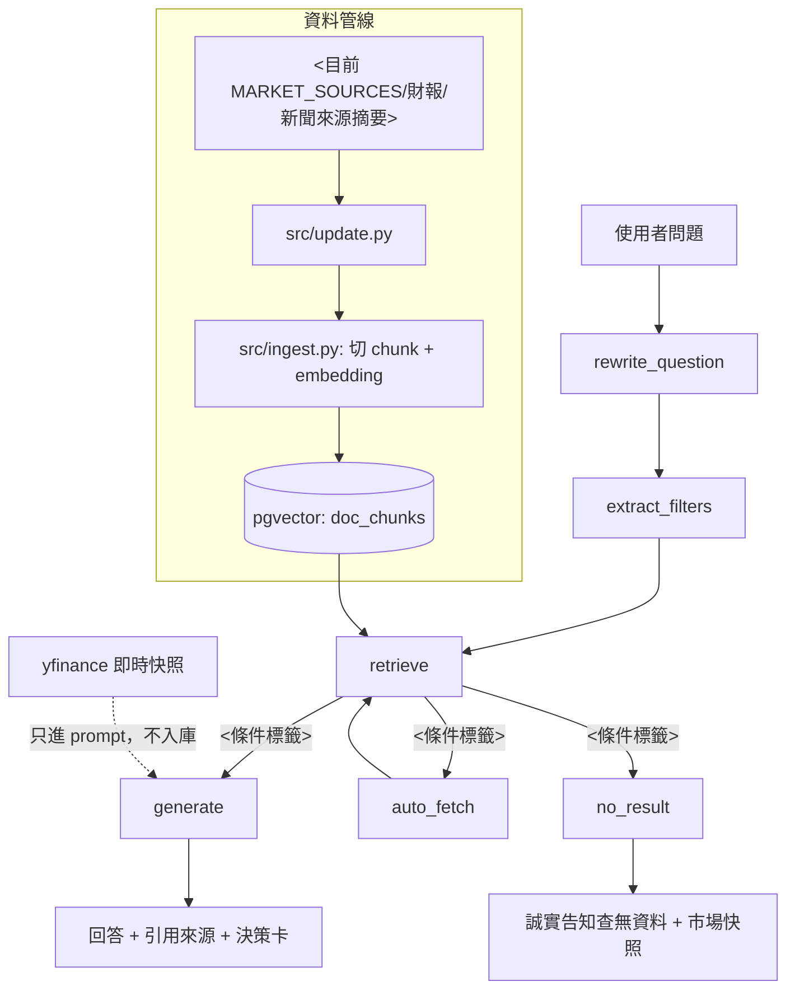

# 同步 LangGraph 架構圖

當 `src/graph.py` 的節點或路由邏輯變動後，用本流程重新產生 mermaid 圖並更新文件。

## 步驟

### 1. 取得權威結構（不要憑印象畫）

```bash
./venv/bin/python -c "from src.graph import build_graph; print(build_graph().get_graph().draw_mermaid())"
```

輸出是節點與邊的唯一事實來源：實線 `-->` 為固定邊、虛線 `-.->` 為條件邊。
文件裡的圖必須與它的節點集合、邊集合一致（僅重新排版與加標籤，不得增刪節點或邊）。

### 2. 讀 `src/graph.py` 的路由函式寫邊標籤

條件邊的人話標籤來自路由函式的實際邏輯（如 `route_after_retrieve`），
不要沿用文件裡的舊標籤——路由條件常改，舊標籤就是本 skill 要修的東西。

### 3. 依專案模板渲染（中英各一份）

固定風格 `flowchart TD`，LangGraph 節點名保持英文原名，其餘標籤翻譯：



注意：mermaid 邊標籤 `|...|` 內不能有 `|` 或未配對引號；含逗號或引號的標籤整段用雙引號包住（如 `NR --> B["Honest 'no data' reply"]`）。

### 4. 更新六個 mermaid 區塊

| 檔案 | 區塊 |
|---|---|
| `docs/PROJECT.md` | `### Architecture`（英）、`### 架構`（中） |
| `README.md` | `### Architecture`（英）、`### 架構`（中） |
| `docs/AI_Product_Case_Study.md` | 系統架構節的中英各一份 |

中英內容必須成對同步。README 尚無該區塊時，加在 Features／功能小節之後。
AI_Product_Case_Study.md 裡有很多 mermaid 圖（CRISP-DM 等），只改 LangGraph 架構圖那兩塊
——用 `grep -n 'rewrite_question' docs/AI_Product_Case_Study.md` 定位，其餘不動；
更新時保留該檔各自的措辭風格（如「使用者提問」），只換過期的邊標籤與來源清單。

### 5. 順手校對

- PROJECT.md「LangGraph node flow」的一行式節點流程字串（節點集合變了才改）。
- 資料管線來源標籤與 `src/update.py` 的 `MARKET_SOURCES` 一致。

## 驗證

四個區塊的節點與邊集合和步驟 1 輸出一致；`grep -c 'mermaid' README.md docs/PROJECT.md` 各為 2。
