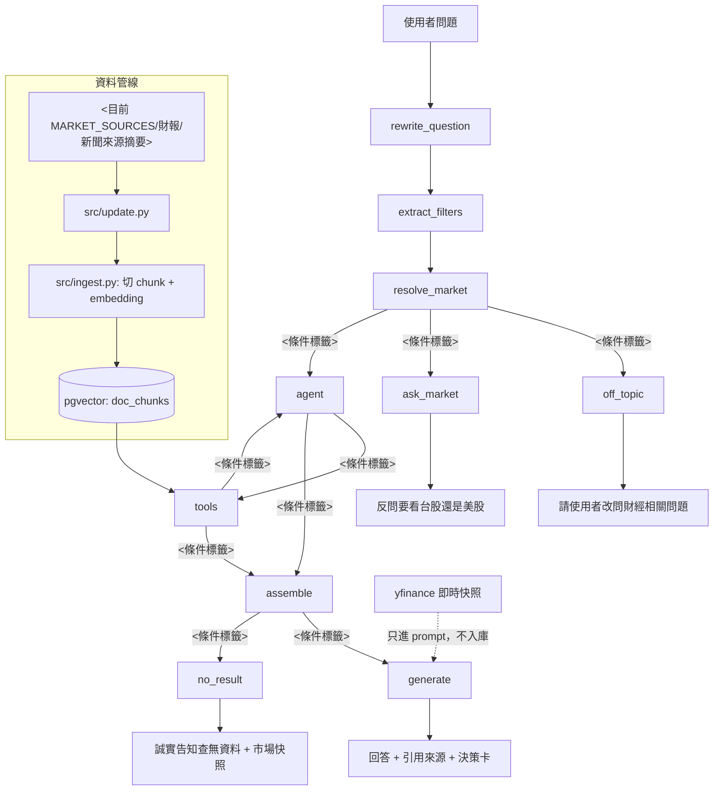

# 同步 LangGraph 架構圖

當 `src/graph.py` 的節點或路由邏輯變動後，用本流程重新產生 mermaid 圖並更新文件。

## 步驟

### 1. 取得權威結構（不要憑印象畫）

```bash
docker compose exec -T app python -c "
import asyncio
from src.graph import build_graph
async def m():
    g = await build_graph()
    print(g.get_graph().draw_mermaid())
asyncio.run(m())
"
```

必須在容器內跑：`build_graph()` 自 `ef76670` 起是 async（要 await），且會連 MCP server
取 tool 清單，本機執行會撞 `422 Unprocessable Entity`（`MCP_SERVER_URL` 指向容器網路）。
先確認 `docker compose ps` 的 app 與 mcp-server 都在 running。

輸出是節點與邊的唯一事實來源：實線 `-->` 為固定邊、虛線 `-.->` 為條件邊。
文件裡的圖必須與它的節點集合、邊集合一致（僅重新排版與加標籤，不得增刪節點或邊）。

### 2. 讀 `src/graph.py` 的路由函式寫邊標籤

條件邊的人話標籤來自路由函式的實際邏輯（`route_after_resolve_market`／
`route_after_tools`／`route_after_assemble`），不要沿用文件裡的舊標籤——
路由條件常改，舊標籤就是本 skill 要修的東西。

節點內部邏輯改動（例如 `generate` 怎麼挑欄位、計時起點移到哪）**不改變圖的拓樸**，
這種改動不需要動圖。先 `git show <commit> -- src/graph.py | grep -E "route_after|add_conditional|add_edge"`
確認有沒有真的動到路由，沒有就只需回報「不需更新」。

### 3. 依專案模板渲染（中英各一份）

固定風格 `flowchart TD`，LangGraph 節點名保持英文原名，其餘標籤翻譯：


```mermaid
flowchart TD
    U[使用者問題] --> RW[rewrite_question]
    RW --> EF[extract_filters]
    EF --> RM[resolve_market]
    RM -->|<條件標籤>| OT[off_topic]
    RM -->|<條件標籤>| AM[ask_market]
    RM -->|<條件標籤>| AG[agent]
    AG -->|<條件標籤>| TL[tools]
    AG -->|<條件標籤>| AS[assemble]
    TL -->|<條件標籤>| AS
    TL -->|<條件標籤>| AG
    AS -->|<條件標籤>| GEN[generate]
    AS -->|<條件標籤>| NR[no_result]
    GEN --> A[回答 + 引用來源 + 決策卡]
    NR --> B[誠實告知查無資料 + 市場快照]
    OT --> C[請使用者改問財經相關問題]
    AM --> D[反問要看台股還是美股]

    subgraph 資料管線
        SRC[<目前 MARKET_SOURCES/財報/新聞來源摘要>] --> UP[src/update.py]
        UP --> ING[src/ingest.py: 切 chunk + embedding]
        ING --> PG[(pgvector: doc_chunks)]
    end
    PG --> TL
    YF[yfinance 即時快照] -.只進 prompt，不入庫.-> GEN
```

模板本身也會過期——以步驟 1 的輸出為準，模板只示範排版風格（節點縮寫、subgraph、
`-.->` 用法），節點集合不一致時信步驟 1。

注意：mermaid 邊標籤 `|...|` 內不能有 `|` 或未配對引號；含逗號或引號的標籤整段用雙引號包住（如 `NR --> B["Honest 'no data' reply"]`）。

### 4. 更新六個 mermaid 區塊

| 檔案 | 區塊 |
|---|---|
| `docs/PROJECT.md` | `### Architecture`（英）、`### 架構`（中） |
| `README.md` | `### Architecture`（英）、`### 架構`（中） |
| `docs/AI_Product_Case_Study.md` | 系統架構節的中英各一份 |

中英內容必須成對同步。README 尚無該區塊時，加在 Features／功能小節之後。
AI_Product_Case_Study.md 裡有很多 mermaid 圖（CRISP-DM 等），只改 LangGraph 架構圖那兩塊
——用 `grep -n 'rewrite_question' docs/AI_Product_Case_Study.md` 定位，其餘不動；
更新時保留該檔各自的措辭風格（如「使用者提問」），只換過期的邊標籤與來源清單。

### 5. 順手校對

- PROJECT.md「LangGraph node flow」的一行式節點流程字串（節點集合變了才改）。
- 資料管線來源標籤與 `src/update.py` 的 `MARKET_SOURCES` 一致。

## 驗證

四個區塊的節點與邊集合和步驟 1 輸出一致；`grep -c 'mermaid' README.md docs/PROJECT.md` 各為 2。
