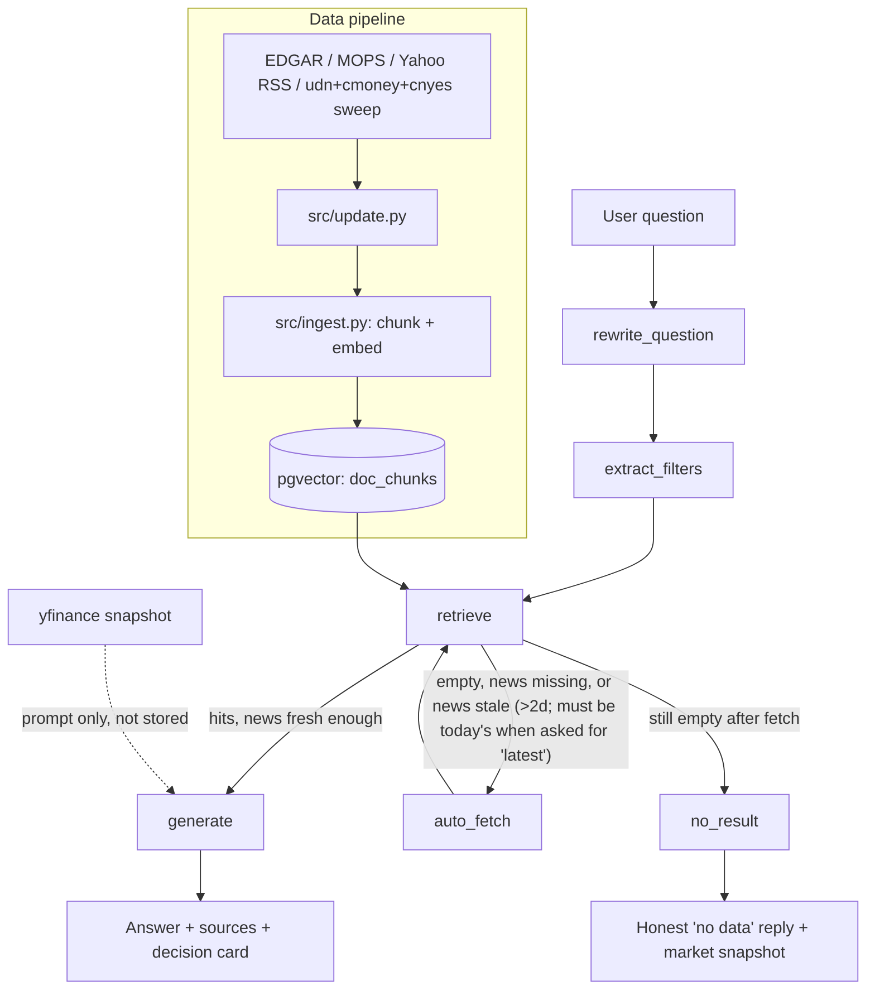
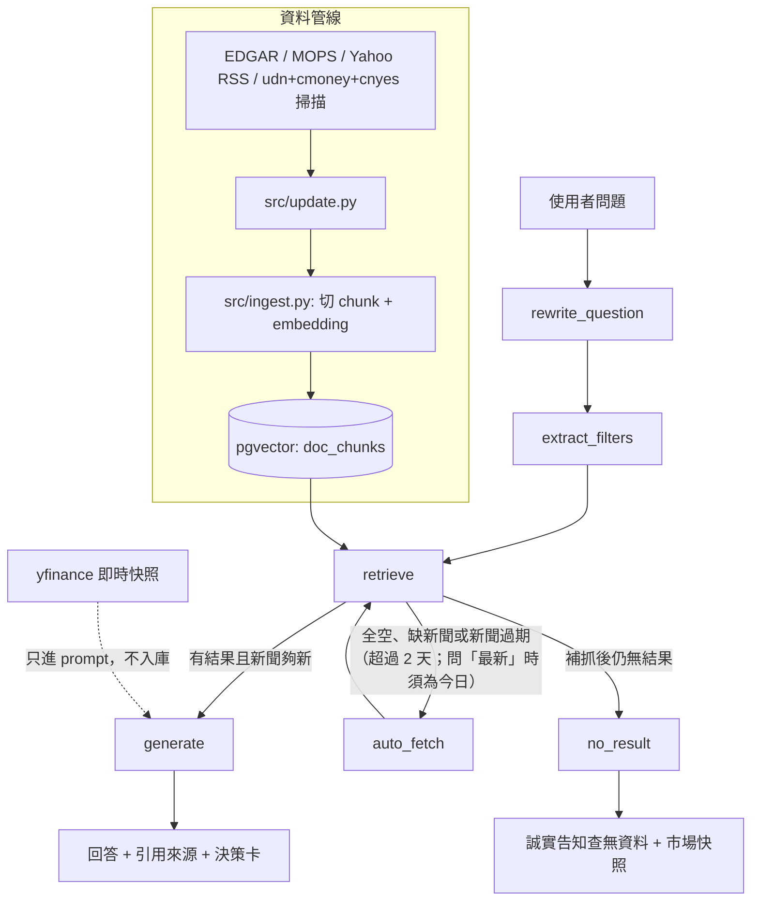

# finance-ai-assistant

[English](#english) | [中文](#中文)

---

<a id="english"></a>
## English

A financial report & news RAG assistant for individual stocks, built with LangGraph + Ollama (local LLM) + pgvector. All inference runs on your machine — sensitive financial data never leaves it.

**Demo:** TODO
**Screenshot:** TODO

### Quick Start

Requirements: Python 3.10+, Docker, [Ollama](https://ollama.com).

```bash
# 1. Ollama models
ollama pull qwen3.5:9b     # LLM
ollama pull bge-m3         # embeddings (multilingual)

# 2. Database (Postgres + pgvector)
docker compose up -d

# 3. Python env
python -m venv venv
source venv/bin/activate
pip install -r requirements.txt
cp .env.example .env       # uses PGVECTOR_URL for the DB connection
psql "$PGVECTOR_URL" -f db/chainlit_schema.sql   # enables thumbs up/down feedback

# 4. Fetch some data
python -m src.update report --market us --company AAPL
python -m src.update news --company 2330 --limit 10

# 5. Chat (inside the venv from step 3 — yfinance/plotly live there)
chainlit run src/app.py -w    # http://localhost:8000
```

### Installation

See steps 1-3 of Quick Start above (Ollama models, database, Python env).

### Features

- **Q&A over reports and news** with source citations, plus a structured decision card (facts, inference, valuation, consensus & thresholds, scenario read, earnings-call watch list, stance, triggers, key event, watch metrics) at the end of each answer
- **Live market snapshot with real analyst consensus**: price, 52-week range, PE, target price, analyst view, plus yfinance consensus data — current-quarter EPS/revenue consensus range, analyst count, past-4-quarter beat/miss, next earnings date — folded into the decision card; any failure degrades gracefully, never breaks the answer
- **Interactive charts under each answer** (real data, no LLM involved): 6-month price line with a next-earnings-date marker, and 8-quarter EPS estimate vs actual grouped bars colored by beat (green) / miss (red)
- **One-command data updates**: SEC EDGAR (US filings incl. 6-K/20-F for foreign issuers), TWSE MOPS (TW reports), Yahoo Finance RSS (news), market-news sweep from udn/cmoney/cnyes listings; idempotent re-runs
- **Auto-fetch on demand**: ask about a company not yet in the DB and it fetches its data automatically (listed companies only); company questions whose newest news is stale (>2 days, or not from today when you ask for "latest/today") re-fetch news once; company-less questions trigger a market-news sweep instead
- **Chainlit web UI**: ChatGPT-style token streaming, multi-turn chat, downloadable PDF report per answer (charts embedded, rendered via headless Chrome; falls back to `.md` when no browser is found)
- **Honest no-result path**: says "no data" instead of hallucinating

### Architecture



### Commands

| Command | What it does |
|---|---|
| `python -m src.update report --market us --company AAPL [--form 10-K]` | Fetch latest US filing from SEC EDGAR (default 10-Q; falls back to 10-K/6-K/20-F/424B4/S-1) |
| `python -m src.update report --market tw --company 2330` | Fetch latest TW report PDF from MOPS (prints manual steps if blocked) |
| `python -m src.update news --company 2330 --limit 10` | Fetch news via Yahoo Finance RSS |
| `python -m src.update market-news [--limit 10]` | Sweep market-news listing pages (udn tw/us, cmoney notes/tag, cnyes us/tw) for general market news |
| `python -m src.update prune --days 180` | Delete news chunks older than N days (reports are never pruned) |
| `python -m src.ingest --file data/x.pdf --company 2330 --doc-type financial_report --date 2026-07-15` | Import a local PDF/txt manually |
| `python -m src.cli` | Terminal chat (single-turn) |
| `chainlit run src/app.py -w` | Web chat UI at http://localhost:8000 |

### Environment variables (data/token control)

| Variable | Default | What it does |
|---|---|---|
| `NEWS_RETENTION_DAYS` | `180` | News chunks older than this are auto-pruned on app startup (reports are never pruned) |
| `HISTORY_ANSWER_MAX_CHARS` | `400` | Max chars of a past answer kept in chat history (trend section stripped first) sent to the LLM on later turns |

For architecture, design decisions, and the full AI Product Case Study (CRISP-DM, ML system design, production risks), see [docs/AI_Product_Case_Study.md](docs/AI_Product_Case_Study.md) and [docs/PROJECT.md](docs/PROJECT.md).

---

<a id="中文"></a>
## 中文

針對個股的財報/新聞 RAG 問答助理,用 LangGraph + Ollama(本地 LLM)+ pgvector 打造。
所有推理都在本機跑,資料不會送到外部 API,適合處理財報這類敏感資料。

**Demo:** TODO
**截圖:** TODO

### 快速開始

環境需求:Python 3.10+、Docker、[Ollama](https://ollama.com)。

```bash
# 1. 安裝 Ollama 模型
ollama pull qwen3.5:9b     # 生成用的 LLM
ollama pull bge-m3         # embedding 模型(支援中文)

# 2. 啟動資料庫(Postgres + pgvector)
docker compose up -d

# 3. Python 環境
python -m venv venv
source venv/bin/activate
pip install -r requirements.txt
cp .env.example .env       # DB 連線用 PGVECTOR_URL(避免與 chainlit 的 DATABASE_URL 撞名)
psql "$PGVECTOR_URL" -f db/chainlit_schema.sql   # 套用後才能在回答上按讚/倒讚

# 4. 抓資料
python -m src.update report --market us --company AAPL
python -m src.update news --company 2330 --limit 10

# 5. 開始聊天(在步驟 3 的 venv 內執行——yfinance/plotly 裝在裡面)
chainlit run src/app.py -w    # 開 http://localhost:8000
```

### 安裝

見上方快速開始的 1-3 步(安裝 Ollama 模型、啟動資料庫、建立 Python 環境)。

### 功能

- **財報/新聞問答**:回答附引用來源,結尾附結構化決策卡(事實、推論、估值、市場共識與門檻、情境解讀、法說會關注清單、立場、觸發條件、關鍵事件、觀察指標)
- **即時市場快照含真實分析師共識**:用 yfinance 抓股價、52 週區間、本益比、目標價、分析師評等,加上共識資料——當季 EPS/營收共識區間、分析師人數、近 4 季 beat/miss、下次財報日——併入決策卡;抓取失敗時優雅降級,不影響回答
- **回答附兩張互動圖表**(全部真資料,LLM 不參與畫圖):6 個月股價走勢線圖(含下次財報日標記)、近 8 季 EPS 預估 vs 實際 grouped bar(beat 綠/miss 紅)
- **一鍵抓取更新**:SEC EDGAR(美股財報,外國發行人含 6-K/20-F)、公開資訊觀測站 MOPS(台股財報)、Yahoo Finance RSS(新聞)、udn/cmoney/鉅亨網 cnyes 市場新聞列表頁掃描;重跑同一來源自動去重
- **自動抓取**:問到未匯入的公司會自動抓取其財報/新聞(僅限上市公司);最新新聞過期時(超過 2 天,問「最新/今天」時新聞必須是今天的)自動重抓一次;沒指定公司的問題則觸發市場新聞掃描
- **Chainlit 網頁介面**:ChatGPT 風格逐字串流、多輪對話、每則回答附可下載 PDF 報告(內嵌圖表,headless Chrome 渲染;找不到瀏覽器時退回 `.md`)
- **查無資料時誠實告知**,不幻覺

### 架構



### 指令表

| 指令 | 用途 |
|---|---|
| `python -m src.update report --market us --company AAPL [--form 10-K]` | 抓美股最新財報(SEC EDGAR,預設 10-Q;依序退回 10-K/6-K/20-F/424B4/S-1) |
| `python -m src.update report --market tw --company 2330` | 抓台股最新財報 PDF(MOPS,被擋時印手動下載步驟) |
| `python -m src.update news --company 2330 --limit 10` | 抓新聞(Yahoo Finance RSS) |
| `python -m src.update market-news [--limit 10]` | 掃市場總覽新聞列表頁（udn tw/us、cmoney notes/tag、鉅亨網 cnyes us/tw） |
| `python -m src.update prune --days 180` | 刪除超過 N 天的新聞 chunk(財報一律保留) |
| `python -m src.ingest --file data/x.pdf --company 2330 --doc-type financial_report --date 2026-07-15` | 手動匯入本地 PDF/txt |
| `python -m src.cli` | 終端問答(單輪) |
| `chainlit run src/app.py -w` | 網頁聊天介面 http://localhost:8000 |

範例問題:

- 「AAPL 最新一季營收多少?」
- 「台積電最新一季的毛利率是多少?」
- 「2330 最近有沒有負面新聞?」

### 環境變數(資料/token 控制)

| 變數 | 預設值 | 用途 |
|---|---|---|
| `NEWS_RETENTION_DAYS` | `180` | 啟動時自動清除超過此天數的新聞 chunk(財報一律保留) |
| `HISTORY_ANSWER_MAX_CHARS` | `400` | 對話歷史中保留的過去回答最大字數(先去掉趨勢觀點段落),控制後續輪次送給 LLM 的 token 量 |

架構、設計決策與完整 AI Product Case Study(CRISP-DM、ML 系統設計、production risks)請見 [docs/AI_Product_Case_Study.md](docs/AI_Product_Case_Study.md) 與 [docs/PROJECT.md](docs/PROJECT.md)。
