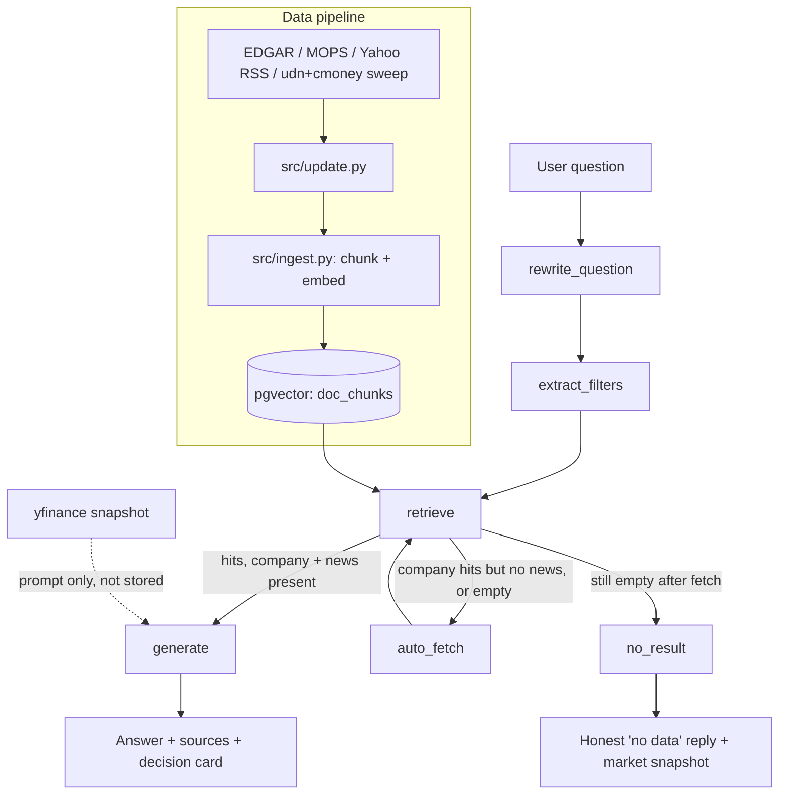
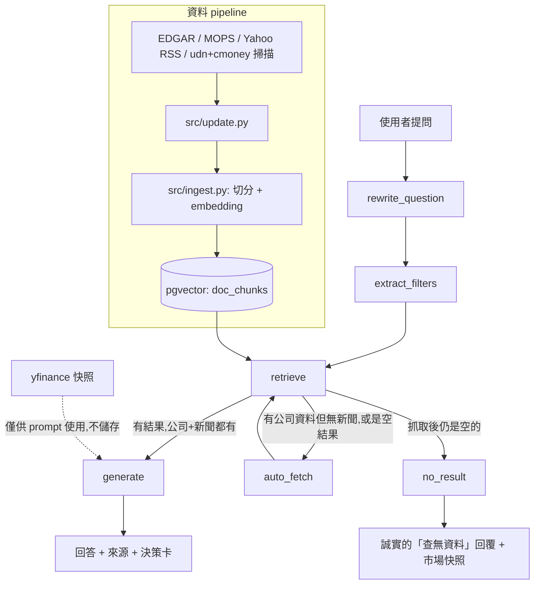
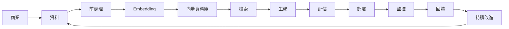

# AI Product Case Study

## Finance AI Assistant

### From Business Understanding to Production ML

[English](#english) | [中文](#中文)

---

<a id="english"></a>
## English

## Executive Summary

Finance AI Assistant is a local Retrieval-Augmented Generation (RAG) application designed to help investors efficiently understand financial reports and company news through natural language interactions.

Instead of relying solely on a large language model's internal knowledge, the system retrieves relevant financial evidence from trusted sources—including SEC EDGAR, TWSE MOPS, and Yahoo Finance—before generating grounded responses with source citations.

Built with LangGraph, Ollama, and pgvector, the project demonstrates an end-to-end AI application that combines semantic retrieval, workflow orchestration, and local LLM inference while addressing practical Machine Learning system considerations such as scalability, maintainability, data freshness, and production reliability.

Beyond technical implementation, this project follows the Machine Learning product lifecycle by evaluating the business opportunity, defining measurable success metrics, validating user value, designing production-ready ML architecture, and identifying operational risks that may arise after deployment.

---

## Project Objectives

This project aims to achieve the following objectives:

- Help investors quickly locate relevant financial information from lengthy reports.
- Reduce manual effort when reviewing financial documents.
- Improve answer reliability through Retrieval-Augmented Generation.
- Increase transparency by providing explicit source citations.
- Demonstrate production-oriented Machine Learning system design rather than a standalone LLM application.

---

## Key Features

### AI Features

- Retrieval-Augmented Generation (RAG)
- Semantic Search using Vector Embeddings
- Automatic Financial Report Retrieval
- Multi-source Knowledge Integration
- Context-aware Question Rewriting
- LLM-based Metadata Extraction
- Source-grounded Response Generation

---

### Product Features

- Natural language financial Q&A
- Financial report search
- News retrieval
- Investor-oriented summaries
- Citation-supported answers
- Local-first deployment
- Downloadable analysis reports

---

## End-to-End ML Workflow


This workflow illustrates the complete Machine Learning lifecycle adopted by this project.

Unlike a traditional chatbot, the system continuously improves through data updates, retrieval optimization, monitoring, and iterative product refinement.

---

## 1. Opportunity Evaluation

### Business Problem

Individual investors often spend significant time reviewing financial reports, quarterly filings, earnings releases, and financial news before making investment decisions.

Although large language models make financial information easier to access, they often generate responses without citing trustworthy evidence, making it difficult for users to verify important financial facts.

Meanwhile, traditional keyword search requires users to know exactly what information they are looking for, which limits its effectiveness for exploratory financial analysis.

This creates an opportunity for an AI-powered assistant capable of understanding natural language, retrieving trustworthy financial evidence, and generating grounded responses.

---

### Why is Machine Learning the Right Solution?

Following the Machine Learning opportunity evaluation framework introduced in this course, this project satisfies three key conditions.

#### 1. Large Amounts of Available Data

Financial reports, earnings filings, and company news are generated continuously and contain rich unstructured information.

These documents provide sufficient data for semantic representation learning and retrieval.

---

#### 2. Difficult to Solve with Explicit Rules

Financial concepts are expressed differently across industries, companies, and reporting periods.

For example, users asking:

> "Is NVIDIA becoming more profitable?"

may require understanding:

- Gross Margin
- Operating Margin
- Revenue Growth
- AI Business Performance
- Management Discussion

Creating manual rules for every possible wording would be impractical.

Embedding models can instead capture semantic similarity between questions and documents.

---

#### 3. Creates Measurable Business Value

Compared with manual document review, the proposed solution can improve:

- Information discovery efficiency
- Financial knowledge accessibility
- User productivity
- Decision support quality
- Trust through transparent citations

Rather than replacing investors, the assistant supports faster evidence discovery and informed decision-making.

---

## 2. CRISP-DM Business Understanding

### Business Objective

The primary objective of this project is to improve how individual investors discover, understand, and interpret financial information.

Rather than replacing financial analysis, Finance AI Assistant serves as an AI-powered research assistant that helps users efficiently locate trustworthy evidence from financial reports and news before making investment decisions.

The project focuses on improving information accessibility, reducing manual document review, and increasing user confidence through transparent, source-grounded responses.

---

### Business Success Criteria

From a product perspective, success is measured by whether users can find accurate financial information more efficiently than traditional search methods.

Desired business outcomes include:

- Reduced time spent reviewing financial reports
- Increased successful information discovery
- Improved user confidence in AI-generated responses
- Higher user engagement with the assistant
- Increased trust through explicit source citations

---

### Problem Definition

#### Current Workflow

```text
Search Company

↓

Download Financial Reports

↓

Read Hundreds of Pages

↓

Search Financial News

↓

Cross-reference Information

↓

Summarize Findings

↓

Make Investment Decision
```

This workflow is time-consuming and often discourages individual investors from performing comprehensive research.

---

#### Pain Points

Current users commonly experience:

- Information scattered across multiple sources
- Financial reports that are lengthy and difficult to navigate
- Difficulty locating relevant evidence
- High cognitive load when comparing multiple documents
- Risk of hallucinated answers from general-purpose LLMs

---

#### Proposed Workflow

```text
Ask Natural Language Question

↓

Semantic Retrieval

↓

Retrieve Relevant Evidence

↓

Generate Grounded Response

↓

Provide Source Citations

↓

Support Investment Research
```

This significantly reduces the effort required to locate relevant financial information while maintaining answer transparency.

---

## Success Metrics

Instead of evaluating only model accuracy, this project measures both product outcomes and machine learning performance.

### Outcome Metrics (Business)

These metrics evaluate user value.

| Metric | Description |
|---------|-------------|
| Task Completion Rate | Percentage of users who successfully obtain the required financial information |
| Time to Information | Average time required to locate desired information |
| User Satisfaction | Survey score after completing tasks |
| User Trust | Degree of confidence in AI-generated responses |
| Repeat Usage | Frequency of returning users |

---

### Output Metrics (Machine Learning)

These metrics evaluate system performance.

| Metric | Description |
|---------|-------------|
| Precision@K | Retrieval relevance |
| Recall@K | Retrieval coverage |
| Citation Accuracy | Correctness of cited sources |
| Grounded Response Rate | Percentage of responses fully supported by retrieved documents |
| Response Latency | End-to-end response time |
| Retrieval Success Rate | Percentage of questions with relevant retrieved documents |

---

## Relevant Factors

The following variables may influence retrieval quality and answer generation.

| Category | Examples |
|-----------|----------|
| Company | Apple, NVIDIA, TSMC |
| Market | US / Taiwan |
| Financial Period | Annual / Quarterly |
| Document Type | Financial Report / News |
| Publication Date | Recent vs Historical |
| User Intent | Profitability, Growth, Risks |
| Chunk Size | Text segmentation strategy |
| Embedding Quality | Semantic representation |
| Top-K | Number of retrieved chunks |

---

## 3. Solution Validation Plan

Developing a technically capable AI system does not necessarily guarantee product success.

Therefore, this project adopts an iterative validation process to evaluate both usability and business value before large-scale deployment.

---

### Proposed Solution

Finance AI Assistant combines Retrieval-Augmented Generation (RAG) with local LLM inference.

Instead of generating answers directly from model parameters, the system first retrieves relevant financial documents and recent news, then generates responses grounded on retrieved evidence.

This approach improves transparency while significantly reducing hallucinations.

---

### Validation Objectives

The validation process aims to answer the following questions:

- Can users obtain financial information more efficiently?
- Do retrieved documents support generated answers?
- Do users trust the provided citations?
- Is the retrieval quality sufficient?
- Does the assistant improve investment research experience?

---

### Validation Strategy

#### Phase 1 — Functional Prototype

Objective

Verify that the complete RAG pipeline functions correctly.

Activities

- Internal testing
- Pipeline verification
- Retrieval quality review
- Citation verification

---

#### Phase 2 — User Evaluation

Recruit users with investing experience.

Evaluate:

- Ease of use
- Information quality
- Citation usefulness
- Response clarity
- Overall satisfaction

Collect qualitative interviews and usability feedback.

---

#### Phase 3 — Iterative Optimization

Based on collected feedback, continuously improve:

- Prompt engineering
- Chunking strategy
- Retrieval ranking
- Metadata extraction
- User interface
- Supported financial sources

This process follows the Build → Measure → Learn product development cycle.

---

### Validation Roadmap


The roadmap emphasizes continuous learning rather than one-time model evaluation.

---

## Relationship with CRISP-DM

This project follows the Business Understanding phase of the CRISP-DM methodology.

Specifically, it defines:

- Business objectives
- User problems
- Success criteria
- Relevant business factors
- Validation strategy

These activities provide the foundation for subsequent data preparation, modeling, deployment, and production monitoring.

---

## 4. ML Lifecycle

This project follows a complete Machine Learning lifecycle, extending beyond model development to include data management, deployment, monitoring, and continuous improvement.

Unlike traditional software systems, ML-powered applications require ongoing updates as both data and user behavior evolve over time.

### ML Lifecycle


This lifecycle illustrates how Finance AI Assistant continuously evolves through iterative improvements rather than remaining a static AI application.

---

### Lifecycle Stages

| Stage | Purpose |
|--------|---------|
| Business Problem | Identify investor pain points and product objectives |
| Data Collection | Retrieve financial reports and news from trusted sources |
| Data Preparation | Clean, chunk, normalize, and enrich documents |
| Embedding | Convert text into vector representations using bge-m3 |
| Vector Storage | Store embeddings in pgvector for semantic retrieval |
| Retrieval | Retrieve relevant document chunks based on semantic similarity |
| Generation | Generate grounded responses with citations |
| Evaluation | Measure retrieval quality and user satisfaction |
| Deployment | Deploy the complete LangGraph workflow locally |
| Monitoring | Track retrieval quality, latency, and data freshness |
| Continuous Improvement | Improve prompts, retrieval, chunking, and knowledge sources |

---

## 5. ML System Design

The project adopts a modular architecture that separates data ingestion, retrieval, reasoning, and response generation.

This design improves maintainability while allowing each component to evolve independently.

---

### System Design Principles

The following principles guided the overall system architecture.

#### Separation of Knowledge and Reasoning

Rather than storing financial knowledge inside model parameters through fine-tuning, the project separates knowledge storage from language reasoning.

Benefits include:

- Easier knowledge updates
- Lower maintenance cost
- Reduced retraining effort
- Better scalability

This is achieved through Retrieval-Augmented Generation (RAG).

---

#### Retrieval Before Generation

Instead of asking the LLM to answer directly, the system first retrieves relevant financial evidence.

Advantages include:

- Higher factual accuracy
- Better explainability
- Source transparency
- Reduced hallucination

---

#### Modular Workflow

Each LangGraph node has a single responsibility.

```
rewrite_question

↓

extract_filters

↓

retrieve

↓

generate

↓

response
```

This design simplifies testing and enables independent optimization of each component.

---

### Major Design Decisions

#### Decision 1 — Retrieval-Augmented Generation

**Why?**

Financial information changes frequently.

Using RAG enables new financial reports and news articles to become immediately searchable without retraining the language model.

---

#### Decision 2 — Local LLM Deployment

The project uses Ollama instead of cloud-hosted APIs.

Reasons include:

- Data privacy
- Lower operational cost
- Offline capability
- Reduced vendor dependency

---

#### Decision 3 — Automatic Data Acquisition

When requested information is unavailable, the assistant automatically retrieves new financial reports and news before retrying.

Benefits:

- Improved knowledge freshness
- Better user experience
- Reduced manual maintenance

---

#### Decision 4 — Vector Database

Instead of traditional keyword search, the project uses pgvector for semantic retrieval.

Advantages:

- Natural language search
- Semantic similarity
- Better retrieval across different wording
- Scalable indexing

---

#### Decision 5 — Citation-based Response Generation

Every generated answer is grounded on retrieved evidence.

Responses include explicit citations, allowing users to verify supporting information directly.

This increases transparency and user trust.

---

## 6. Production Risks

Deploying an AI application requires continuous monitoring beyond model accuracy.

The following risks were considered during system design.

---

### Risk 1 — Data Drift

Financial reports and news are continuously updated.

If the knowledge base becomes outdated, retrieval quality will gradually decline.

#### Business Impact

- Outdated financial information
- Missing recent company events
- Reduced answer relevance

#### Mitigation

- Scheduled document synchronization
- Automatic report retrieval
- Incremental document updates

#### Monitoring Metrics

- Knowledge freshness
- Number of outdated documents
- Update frequency

---

### Risk 2 — Concept Drift

Investor interests evolve over time.

For example:

Past

- Revenue
- Profit
- EPS

Today

- AI investments
- Supply chain
- ESG
- Geopolitical risks

As user intent changes, prompts and retrieval strategies should be continuously refined.

#### Monitoring

- Frequently asked questions
- Query clustering
- User feedback
- Search trends

---

### Risk 3 — Training-Serving Skew

Retrieval quality depends on consistent embedding generation.

If different preprocessing steps or embedding models are used during indexing and querying, retrieval performance may deteriorate.

#### Mitigation

- Version embedding models
- Standardized preprocessing
- Periodic retrieval evaluation

---

### Risk 4 — Hallucination

Although RAG significantly reduces hallucinations, unsupported conclusions may still occur.

#### Mitigation

- Retrieval-first workflow
- Source citations
- Prompt constraints
- Honest "No Result" responses

---

### Risk 5 — Latency

Automatic document retrieval increases response time.

#### Mitigation

- Background synchronization
- Local vector search
- Caching
- Streaming responses

---

### Risk 6 — Data Quality

Financial documents originate from multiple providers and formats.

Potential issues include:

- OCR errors
- Broken PDF parsing
- Duplicate documents
- Missing metadata

#### Mitigation

- Metadata normalization
- Source validation
- Idempotent ingestion
- Duplicate detection

---

### Production Monitoring Dashboard

The following indicators can be continuously monitored after deployment.

| Category | Example Metrics |
|-----------|-----------------|
| Retrieval | Precision@K, Recall@K |
| Response | Grounded Response Rate, Citation Accuracy |
| System | Response Latency, Error Rate |
| Data | Data Freshness, Document Coverage |
| User | Satisfaction Score, Repeat Usage |
| Product | Task Completion Rate, Active Users |

These metrics help ensure the assistant continues delivering reliable financial insights while maintaining a high-quality user experience.

---

## 7. Technical Architecture

The Finance AI Assistant adopts a modular Retrieval-Augmented Generation (RAG) architecture that separates data ingestion, retrieval, orchestration, and response generation.

This modular design improves maintainability, extensibility, and production readiness while allowing individual components to evolve independently.

> **Implementation Details**
>
> The following sections document the implementation architecture of the system, including workflow orchestration, data pipeline, storage layer, and major modules.

### Overall Architecture



The architecture consists of four major layers:

| Layer | Responsibility |
|--------|----------------|
| Data Pipeline | Collect, clean, chunk, and embed financial documents |
| Knowledge Base | Store embeddings inside PostgreSQL with pgvector |
| Retrieval Layer | Perform semantic retrieval and filtering |
| Application Layer | LangGraph workflow, response generation, and Chainlit interface |

---

### LangGraph Workflow

Workflow:

`rewrite_question → extract_filters → retrieve → (generate | auto_fetch → retrieve | no_result)`

| Node | Role |
|---|---|
| `rewrite_question` | With chat history, rewrites a follow-up ("what about margins?") into a standalone question so embedding retrieval works; passes through when history is empty |
| `extract_filters` | LLM extracts company code (TW 4-digit or US ticker) / doc type from the question as retrieval filters (null = no filter) |
| `retrieve` | Embeds the question (bge-m3) and runs cosine similarity search in pgvector, top-5; for company questions also blends in top-3 company news and top-2 global market news as decision-card context |
| `auto_fetch` | Runs once (guarded by `fetched`). If a company was named: fetches its reports + news (skipping reports if already retrieved), always also sweeps market-news (top-3, `fetch_market_news`); a company-less empty retrieval sweeps market-news too, so it never dead-ends at `no_result` on the first try. Single-source failures are swallowed, not fatal |
| `generate` | Answers strictly from retrieved chunks with `[SourceN]` citations, folds in a live yfinance market snapshot (price, 52w range, PE, target price, analyst view — prompt-only, never a citable source, degrades silently on failure), then appends a fixed decision-card section (facts w/ citations, inference, valuation, stance, triggers, key event, watch metrics) with a disclaimer; stance is only asserted when filings+news+market data support it, but triggers/key event/watch metrics are always required so the answer never abstains outright |
| `no_result` | When nothing is retrieved even after auto_fetch, honestly says so, still appending the market snapshot and watch items instead of hallucinating |

Each node has a single responsibility, making the workflow easy to maintain and extend.

---

### Data Pipeline

The pipeline performs:

1. Document Collection
2. Text Cleaning
3. Chunking
4. Embedding Generation
5. Vector Storage
6. Semantic Retrieval

---

### Source Modules

The project follows a modular codebase that separates configuration, ingestion, retrieval, orchestration, and user interface.

#### Modules (`src/`)

| File | Purpose |
|---|---|
| `config.py` | Central settings from `.env` (DB URL, Ollama URL/models, chunking, top-k, SEC user agent) |
| `vectorstore.py` | psycopg + pgvector access layer: `insert_chunks`, `delete_by_source`, `similarity_search` |
| `ingest.py` | `ingest_text` (chunk → embed → insert, deduped by source) and `ingest_file` (PDF/txt loader); CLI `python -m src.ingest` |
| `update.py` | Manual fetchers: SEC EDGAR (US 10-K/10-Q), MOPS (TW report PDFs), Yahoo Finance RSS news, market-news sweep (udn/cmoney listing pages via trafilatura); CLI `python -m src.update` |
| `market.py` | `get_market_snapshot(company)`: live yfinance quote (price, 52w range, PE, target price, analyst view), formatted for the prompt only — any failure returns `None` and never raises |
| `i18n.py` | Centralized bilingual (zh/en) UI and prompt strings, no i18n library |
| `graph.py` | LangGraph pipeline described above; `build_graph()` returns the compiled app |
| `cli.py` | Terminal chat (single-turn) |
| `app.py` | Chainlit web UI: token streaming, multi-turn (last 5 rounds in session memory), downloadable `.md` analysis per answer |

---

### Database Schema

Embeddings are stored inside PostgreSQL using pgvector.

Each document chunk contains:

- Source
- Company
- Document Type
- Publication Date
- Chunk Index
- Embedding Vector

#### DB schema (`db/init.sql`)

Single table `doc_chunks`:

```sql
id BIGSERIAL PK, source VARCHAR(512), doc_type VARCHAR(50),  -- 'financial_report' / 'news'
company VARCHAR(100), published_at DATE, chunk_index INT,
content TEXT, embedding VECTOR(1024),                        -- bge-m3 dimension
created_at TIMESTAMPTZ
```

HNSW cosine index on `embedding`, plus B-tree indexes on `company` and `doc_type`.

---

### Data Sources

Trusted financial information is collected from:

- SEC EDGAR
- TWSE MOPS
- Yahoo Finance RSS

Using authoritative sources improves answer reliability while reducing misinformation.

#### Data sources & update commands

| Data | Source | Command |
|---|---|---|
| US reports | SEC EDGAR (ticker → CIK → latest 10-K/10-Q HTML, text via trafilatura) | `python -m src.update report --market us --company AAPL [--form 10-K]` |
| TW reports | TWSE MOPS (`doc.twse.com.tw/server-java/t57sb01`, two-step PDF download) | `python -m src.update report --market tw --company 2330` |
| News | Yahoo Finance RSS (`.TW` suffix auto-added for 4-digit TW codes) | `python -m src.update news --company 2330 --limit 10` |
| Market news | udn (tw/us) + cmoney (notes/tag) listing pages, article body via trafilatura; titles carrying a 4-digit TW code get auto-tagged with that company; `source_exists()` skips already-ingested articles so re-sweeping is cheap | `python -m src.update market-news [--limit 10]` |
| Live market snapshot | yfinance quote (price, 52w range, PE, target price, analyst view) — prompt-only, never stored in `doc_chunks` | n/a (fetched inline by `generate`) |
| Prune old news | Deletes news chunks older than N days (default 180); reports are never pruned | `python -m src.update prune --days 180` |

Re-running any command on the same source replaces old chunks (idempotent).

---

## 8. Evaluation Strategy

Machine Learning systems should be evaluated from multiple perspectives rather than relying solely on model accuracy.

This project considers four complementary evaluation stages.

---

### 1. Retrieval Evaluation

Evaluate whether the correct document chunks are retrieved.

Example metrics:

- Precision@K
- Recall@K
- Mean Reciprocal Rank (MRR)
- Retrieval Success Rate

---

### 2. Response Evaluation

Evaluate response quality.

Metrics include:

- Grounded Response Rate
- Citation Accuracy
- Faithfulness
- Response Completeness

---

### 3. User Evaluation

Collect qualitative feedback from users.

Evaluation criteria:

- Ease of use
- Response usefulness
- Trustworthiness
- Overall satisfaction

---

### 4. Production Monitoring

After deployment, continuously monitor:

- Retrieval quality
- Response latency
- Data freshness
- System availability
- User engagement

Evaluation is treated as an ongoing process rather than a one-time activity.

---

## 9. Future Roadmap

Future development will focus on both product capabilities and ML system improvements.

### Product Roadmap

- Personalized watchlists
- Portfolio-aware recommendations
- Multi-company comparison
- Interactive financial dashboards
- Mobile application support

---

### ML Roadmap

- Hybrid Search (BM25 + Vector Search)
- Cross-Encoder Reranking
- Better chunking strategies
- Query expansion
- Automatic metadata extraction
- Knowledge Graph integration

---

### Engineering Roadmap

- Persistent conversation memory
- Scheduled synchronization
- Incremental indexing
- Embedding version management
- Automated evaluation pipeline
- CI/CD for data ingestion

---

## Appendix A — CRISP-DM Mapping

| CRISP-DM Phase | This Project |
|----------------|-------------|
| Business Understanding | Opportunity evaluation, business objectives, success metrics |
| Data Understanding | Financial reports, news sources, metadata |
| Data Preparation | Cleaning, chunking, embedding generation |
| Modeling | Retrieval-Augmented Generation |
| Evaluation | Retrieval metrics, user validation, monitoring |
| Deployment | LangGraph workflow with local Ollama inference |

This project follows the complete CRISP-DM methodology while adapting it to modern Retrieval-Augmented Generation systems.

---

## Appendix B — ML Lifecycle Mapping


Unlike traditional machine learning projects that end after deployment, this project emphasizes continuous improvement driven by user feedback, monitoring, and knowledge updates.

---

## Appendix C — Technology Stack

| Layer | Technologies |
|--------|--------------|
| Programming Language | Python |
| Workflow Orchestration | LangGraph |
| LLM | Ollama (Qwen3.5) |
| Embedding Model | bge-m3 |
| Vector Database | PostgreSQL + pgvector |
| Frontend | Chainlit |
| Financial Data | SEC EDGAR, TWSE MOPS, Yahoo Finance RSS |

---

## Conclusion

Finance AI Assistant demonstrates how Retrieval-Augmented Generation can be applied to solve real-world financial information retrieval problems through a production-oriented AI system.

Rather than focusing solely on large language models, the project integrates business understanding, semantic retrieval, workflow orchestration, production monitoring, and continuous improvement into a complete Machine Learning product lifecycle.

This case study illustrates that building successful AI applications requires not only capable models but also trustworthy data pipelines, robust retrieval mechanisms, measurable product outcomes, and continuous operational monitoring.

The project reflects an AI Product Management perspective by connecting business value, user needs, ML system design, and production deployment into a unified end-to-end solution.

---

<a id="中文"></a>
## 中文

## 摘要

Finance AI Assistant 是一個在本機執行的檢索增強生成(RAG)應用,目的是幫助投資人透過自然語言互動,有效率地理解財報與公司新聞。

系統不是單純仰賴大型語言模型內部的知識,而是先從可信來源——包括 SEC EDGAR、台灣公開資訊觀測站(MOPS)、Yahoo Finance——檢索相關的財務證據,再生成附上來源引用、有憑有據的回答。

專案以 LangGraph、Ollama、pgvector 打造,展示了一個結合語意檢索、流程編排與本地 LLM 推論的端對端 AI 應用,同時處理可擴充性、可維護性、資料新鮮度、上線穩定性等實務上的機器學習系統議題。

除了技術實作之外,本專案也遵循機器學習產品生命週期:評估商業機會、定義可衡量的成功指標、驗證使用者價值、設計可上線的 ML 架構,並找出部署後可能發生的維運風險。

---

## 專案目標

本專案的目標如下:

- 幫助投資人快速從冗長的財報中找到相關資訊。
- 減少人工審閱財務文件的負擔。
- 透過檢索增強生成提升回答的可靠性。
- 以明確的來源引用提升透明度。
- 展示以正式環境為導向的機器學習系統設計,而非單純的 LLM 應用。

---

## 主要功能

### AI 功能

- 檢索增強生成(RAG)
- 以向量嵌入進行語意搜尋
- 自動財報檢索
- 多來源知識整合
- 具上下文感知的問題改寫
- 以 LLM 進行 metadata 擷取
- 有憑有據(source-grounded)的回答生成

---

### 產品功能

- 自然語言財務問答
- 財報搜尋
- 新聞檢索
- 面向投資人的摘要
- 附引用來源的回答
- 本地優先部署
- 可下載的分析報告

---

## 端對端 ML 工作流程


這個工作流程呈現了本專案採用的完整機器學習生命週期。

與傳統聊天機器人不同,系統透過資料更新、檢索優化、監控與反覆的產品改善持續進步。

---

## 1. 商業機會評估

### 商業問題

個人投資人在做出投資決策前,經常要花大量時間審閱財報、季報、財測公告與財經新聞。

雖然大型語言模型讓財務資訊更容易取得,但它們生成的回答經常沒有引用可信證據,使用者難以驗證重要的財務事實。

同時,傳統的關鍵字搜尋要求使用者確切知道自己在找什麼,這限制了它在探索性財務分析上的效用。

這創造了一個機會:打造一個能理解自然語言、檢索可信財務證據、生成有憑有據回答的 AI 助理。

---

### 為什麼機器學習是正確的解法?

依照課程介紹的機器學習機會評估框架,本專案滿足三個關鍵條件。

#### 1. 有大量可用資料

財報、財測公告、公司新聞持續產生,包含豐富的非結構化資訊。

這些文件為語意表示學習與檢索提供了充足的資料。

---

#### 2. 難以用明確規則解決

財務概念在不同產業、公司、報告期間的表達方式都不同。

例如使用者問:

> 「NVIDIA 的獲利能力是不是在提升?」

可能需要理解:

- 毛利率
- 營業利益率
- 營收成長
- AI 業務表現
- 管理層討論

要為每一種可能的問法手動寫規則並不實際。

Embedding 模型則能捕捉問題與文件之間的語意相似度。

---

#### 3. 能創造可衡量的商業價值

相較於人工審閱文件,本方案可以提升:

- 資訊探索效率
- 財務知識的可及性
- 使用者生產力
- 決策支援品質
- 透過透明引用建立信任

這個助理並非取代投資人,而是幫助他們更快找到證據、做出更明智的決策。

---

## 2. CRISP-DM 商業理解

### 商業目標

本專案的主要目標,是改善個人投資人發掘、理解、詮釋財務資訊的方式。

Finance AI Assistant 並非取代財務分析,而是作為一個 AI 研究助理,幫助使用者在做出投資決策前,有效率地從財報與新聞中找到可信的證據。

專案聚焦於提升資訊可及性、減少人工文件審閱,並透過透明、有憑有據的回答提升使用者信心。

---

### 商業成功標準

從產品角度來看,成功與否取決於使用者是否能比傳統搜尋方式更有效率地找到正確的財務資訊。

期望達成的商業成果包括:

- 減少審閱財報所花的時間
- 提升資訊探索的成功率
- 提升使用者對 AI 生成回答的信心
- 提高使用者與助理的互動頻率
- 透過明確的來源引用提升信任

---

### 問題定義

#### 現行工作流程

```text
搜尋公司

↓

下載財報

↓

閱讀數百頁內容

↓

搜尋財經新聞

↓

交叉比對資訊

↓

彙整發現

↓

做出投資決策
```

這個流程耗時,經常讓個人投資人打消進行全面研究的念頭。

---

#### 痛點

現有使用者常遇到的問題:

- 資訊分散在多個來源
- 財報冗長、難以瀏覽
- 難以找到相關證據
- 比對多份文件時認知負荷高
- 通用型 LLM 有幻覺回答的風險

---

#### 建議的工作流程

```text
以自然語言提問

↓

語意檢索

↓

檢索相關證據

↓

生成有憑有據的回答

↓

提供來源引用

↓

支援投資研究
```

這大幅降低了尋找相關財務資訊所需的心力,同時維持回答的透明度。

---

## 成功指標

本專案不只評估模型準確度,同時衡量產品成果與機器學習效能。

### 成果指標(商業面)

這些指標評估使用者價值。

| 指標 | 說明 |
|---------|-------------|
| 任務完成率 | 成功取得所需財務資訊的使用者比例 |
| 取得資訊所需時間 | 找到期望資訊所需的平均時間 |
| 使用者滿意度 | 完成任務後的問卷分數 |
| 使用者信任度 | 對 AI 生成回答的信心程度 |
| 回訪率 | 回訪使用者的頻率 |

---

### 產出指標(機器學習面)

這些指標評估系統效能。

| 指標 | 說明 |
|---------|-------------|
| Precision@K | 檢索相關性 |
| Recall@K | 檢索涵蓋率 |
| 引用正確率 | 引用來源的正確性 |
| 有憑有據回答比例(Grounded Response Rate) | 完全由檢索文件支持的回答比例 |
| 回應延遲 | 端對端回應時間 |
| 檢索成功率 | 檢索到相關文件的問題比例 |

---

## 相關因素

以下變數可能影響檢索品質與回答生成。

| 類別 | 範例 |
|-----------|----------|
| 公司 | Apple、NVIDIA、台積電 |
| 市場 | 美股 / 台股 |
| 財務期間 | 年度 / 季度 |
| 文件類型 | 財報 / 新聞 |
| 發布日期 | 近期 vs 歷史 |
| 使用者意圖 | 獲利能力、成長性、風險 |
| Chunk 大小 | 文字切分策略 |
| Embedding 品質 | 語意表示 |
| Top-K | 檢索的 chunk 數量 |

---

## 3. 方案驗證計畫

打造一個技術上可行的 AI 系統,不代表產品一定會成功。

因此本專案在大規模上線前,採用反覆驗證流程來評估可用性與商業價值。

---

### 提出的方案

Finance AI Assistant 結合檢索增強生成(RAG)與本地 LLM 推論。

系統不是直接從模型參數生成答案,而是先檢索相關財報與近期新聞,再基於檢索到的證據生成回答。

這個做法在大幅降低幻覺的同時,也提升了透明度。

---

### 驗證目標

驗證流程希望回答以下問題:

- 使用者能否更有效率地取得財務資訊?
- 檢索到的文件是否支持生成的回答?
- 使用者是否信任提供的引用?
- 檢索品質是否足夠?
- 這個助理是否改善了投資研究體驗?

---

### 驗證策略

#### 第一階段——功能原型

目標

驗證完整的 RAG pipeline 能正常運作。

活動

- 內部測試
- Pipeline 驗證
- 檢索品質檢視
- 引用驗證

---

#### 第二階段——使用者評估

招募有投資經驗的使用者。

評估項目:

- 易用性
- 資訊品質
- 引用的實用性
- 回答清晰度
- 整體滿意度

蒐集質性訪談與可用性回饋。

---

#### 第三階段——反覆優化

根據蒐集到的回饋,持續改進:

- Prompt 工程
- 切分(chunking)策略
- 檢索排序
- Metadata 擷取
- 使用者介面
- 支援的財務資料來源

這個流程遵循 Build → Measure → Learn 的產品開發循環。

---

### 驗證路線圖


這個路線圖強調的是持續學習,而非一次性的模型評估。

---

## 與 CRISP-DM 的關係

本專案遵循 CRISP-DM 方法論中的商業理解(Business Understanding)階段。

具體而言,它定義了:

- 商業目標
- 使用者問題
- 成功標準
- 相關商業因素
- 驗證策略

這些活動為後續的資料準備、建模、部署與上線監控奠定基礎。

---

## 4. ML 生命週期

本專案遵循完整的機器學習生命週期,涵蓋範圍不只是模型開發,還包括資料管理、部署、監控與持續改進。

與傳統軟體系統不同,ML 應用需要隨著資料與使用者行為隨時間演變而持續更新。

### ML 生命週期


這個生命週期展現了 Finance AI Assistant 如何透過反覆改進持續演化,而非一個靜態的 AI 應用。

---

### 生命週期各階段

| 階段 | 目的 |
|--------|---------|
| 商業問題 | 找出投資人痛點與產品目標 |
| 資料蒐集 | 從可信來源取得財報與新聞 |
| 資料前處理 | 清理、切分、正規化並補充文件 metadata |
| Embedding | 用 bge-m3 把文字轉為向量表示 |
| 向量儲存 | 把 embedding 存進 pgvector 供語意檢索 |
| 檢索 | 依語意相似度檢索相關文件片段 |
| 生成 | 生成附引用的有憑有據回答 |
| 評估 | 衡量檢索品質與使用者滿意度 |
| 部署 | 在本地部署完整的 LangGraph 工作流程 |
| 監控 | 追蹤檢索品質、延遲、資料新鮮度 |
| 持續改進 | 改進 prompt、檢索、切分策略與知識來源 |

---

## 5. ML 系統設計

本專案採用模組化架構,將資料擷取、檢索、推理與回答生成互相分離。

這個設計提升了可維護性,同時讓每個元件都能獨立演進。

---

### 系統設計原則

以下原則指導了整體系統架構。

#### 知識與推理分離

本專案不透過微調把財務知識存進模型參數,而是把知識儲存與語言推理分開。

好處包括:

- 更容易更新知識
- 較低的維護成本
- 減少重新訓練的成本
- 更好的可擴充性

這是透過檢索增強生成(RAG)達成的。

---

#### 先檢索、後生成

系統不是直接要求 LLM 回答,而是先檢索相關財務證據。

優點包括:

- 更高的事實準確性
- 更好的可解釋性
- 來源透明
- 減少幻覺

---

#### 模組化工作流程

每個 LangGraph 節點只負責單一職責。

```
rewrite_question

↓

extract_filters

↓

retrieve

↓

generate

↓

response
```

這個設計讓測試更簡單,也讓每個元件可以獨立優化。

---

### 主要設計決策

#### 決策 1——檢索增強生成

**為什麼?**

財務資訊變化頻繁。

使用 RAG 讓新財報與新聞文章可以立即被搜尋到,而不需要重新訓練語言模型。

---

#### 決策 2——本地 LLM 部署

本專案使用 Ollama,而非雲端託管的 API。

原因包括:

- 資料隱私
- 較低的營運成本
- 離線可用
- 減少對供應商的依賴

---

#### 決策 3——自動資料抓取

當所需資訊不存在時,助理會自動抓取新的財報與新聞,再重試一次。

好處:

- 提升知識新鮮度
- 更好的使用者體驗
- 減少人工維護

---

#### 決策 4——向量資料庫

本專案使用 pgvector 進行語意檢索,取代傳統關鍵字搜尋。

優點:

- 自然語言搜尋
- 語意相似度比對
- 對不同措辭有更好的檢索效果
- 可擴充的索引

---

#### 決策 5——以引用為基礎的回答生成

每一則生成的回答都建立在檢索到的證據之上。

回答附有明確的引用,讓使用者可以直接驗證支持的資訊。

這提升了透明度與使用者信任。

---

## 6. 上線後風險(Production Risks)

部署一個 AI 應用,需要的監控不只是模型準確度。

以下風險在系統設計階段就被納入考量。

---

### 風險 1——資料飄移(Data Drift)

財報與新聞持續在更新。

如果知識庫變得過時,檢索品質會逐漸下降。

#### 商業影響

- 財務資訊過時
- 錯過近期公司事件
- 回答相關性下降

#### 緩解措施

- 排程文件同步
- 自動財報抓取
- 增量式文件更新

#### 監控指標

- 知識新鮮度
- 過時文件數量
- 更新頻率

---

### 風險 2——概念飄移(Concept Drift)

投資人關注的重點會隨時間改變。

例如:

過去

- 營收
- 獲利
- EPS

現在

- AI 投資
- 供應鏈
- ESG
- 地緣政治風險

隨著使用者意圖改變,prompt 與檢索策略應該持續調整。

#### 監控方式

- 常見問題
- 查詢分群(query clustering)
- 使用者回饋
- 搜尋趨勢

---

### 風險 3——訓練與服務不一致(Training-Serving Skew)

檢索品質取決於 embedding 產生方式的一致性。

如果索引階段與查詢階段使用不同的前處理步驟或 embedding 模型,檢索效能可能會下降。

#### 緩解措施

- 為 embedding 模型做版本控管
- 標準化前處理流程
- 定期評估檢索效能

---

### 風險 4——幻覺(Hallucination)

雖然 RAG 大幅降低了幻覺,但仍可能出現沒有根據的結論。

#### 緩解措施

- 先檢索、後生成的工作流程
- 來源引用
- Prompt 限制
- 誠實回覆「查無資料」

---

### 風險 5——延遲(Latency)

自動文件檢索會增加回應時間。

#### 緩解措施

- 背景同步
- 本地向量搜尋
- 快取
- 串流回應

---

### 風險 6——資料品質

財務文件來自多個提供者、多種格式。

可能出現的問題包括:

- OCR 錯誤
- PDF 解析失敗
- 重複文件
- 缺少 metadata

#### 緩解措施

- Metadata 正規化
- 來源驗證
- 具冪等性(idempotent)的資料匯入
- 重複偵測

---

### 上線監控儀表板

以下指標可在部署後持續監控。

| 類別 | 範例指標 |
|-----------|-----------------|
| 檢索 | Precision@K、Recall@K |
| 回答 | 有憑有據回答比例、引用正確率 |
| 系統 | 回應延遲、錯誤率 |
| 資料 | 資料新鮮度、文件涵蓋率 |
| 使用者 | 滿意度分數、回訪率 |
| 產品 | 任務完成率、活躍使用者數 |

這些指標有助於確保助理持續提供可靠的財務洞見,同時維持高品質的使用者體驗。

---

## 7. 技術架構

Finance AI Assistant 採用模組化的檢索增強生成(RAG)架構,將資料擷取、檢索、流程編排與回答生成互相分離。

這個模組化設計提升了可維護性、可擴充性與上線穩定性,同時讓各個元件能獨立演進。

> **實作細節**
>
> 以下章節記錄系統的實作架構,包括工作流程編排、資料 pipeline、儲存層與主要模組。

### 整體架構



架構包含四個主要層級:

| 層級 | 職責 |
|--------|----------------|
| 資料 Pipeline | 蒐集、清理、切分並 embed 財務文件 |
| 知識庫 | 用 pgvector 把 embedding 存進 PostgreSQL |
| 檢索層 | 執行語意檢索與過濾 |
| 應用層 | LangGraph 工作流程、回答生成、Chainlit 介面 |

---

### LangGraph 工作流程

流程:

`rewrite_question → extract_filters → retrieve → (generate | auto_fetch → retrieve | no_result)`

| 節點 | 職責 |
|---|---|
| `rewrite_question` | 根據對話歷史,把追問(例如「那毛利率呢?」)改寫成獨立完整的問題,讓 embedding 檢索能運作;歷史為空時直接通過 |
| `extract_filters` | LLM 從問題中擷取公司代號(台股 4 碼或美股 ticker)/ 文件類型,作為檢索過濾條件(null 表示不過濾) |
| `retrieve` | 用 bge-m3 把問題轉成向量,在 pgvector 做 cosine 相似度搜尋,取前 5 筆;若問題指定公司,還會混入前 3 筆該公司新聞與前 2 筆全市場新聞,作為決策卡的上下文 |
| `auto_fetch` | 只執行一次(由 `fetched` 旗標保護)。若問題指定了公司:抓取該公司的財報+新聞(若財報已存在則跳過),同時一律掃描市場新聞(取前 3 筆,`fetch_market_news`);沒指定公司且檢索為空時,同樣觸發市場新聞掃描,確保第一次嘗試不會直接落到 `no_result`。單一來源失敗會被吞掉,不會讓流程中斷 |
| `generate` | 嚴格根據檢索到的內容回答,附上 `[SourceN]` 引用;同時併入即時 yfinance 市場快照(股價、52 週區間、本益比、目標價、分析師評等——僅供 prompt 使用,不算引用來源,失敗時默默降級),接著附上固定格式的決策卡(附引用的事實、推論、估值、立場、觸發條件、關鍵事件、觀察指標)與免責聲明;只有在財報+新聞+市場資料都支持時,才會明確表態立場,但觸發條件/關鍵事件/觀察指標一律必須提供,確保回答不會整段棄權 |
| `no_result` | 即使 auto_fetch 後仍檢索不到任何內容,也誠實告知,並附上市場快照與觀察項目,而不是產生幻覺回答 |

每個節點只負責單一職責,讓工作流程容易維護與擴充。

---

### 資料 Pipeline

Pipeline 執行以下步驟:

1. 文件蒐集
2. 文字清理
3. 切分(Chunking)
4. Embedding 生成
5. 向量儲存
6. 語意檢索

---

### 原始碼模組

本專案採用模組化的程式碼結構,將設定、資料擷取、檢索、流程編排與使用者介面互相分離。

#### 模組(`src/`)

| 檔案 | 用途 |
|---|---|
| `config.py` | 從 `.env` 讀取集中設定(DB URL、Ollama URL/模型、切分參數、top-k、SEC user agent) |
| `vectorstore.py` | psycopg + pgvector 存取層:`insert_chunks`、`delete_by_source`、`similarity_search` |
| `ingest.py` | `ingest_text`(切分 → embed → 寫入,依來源去重)與 `ingest_file`(PDF/txt 載入器);CLI 為 `python -m src.ingest` |
| `update.py` | 手動抓取器:SEC EDGAR(美股 10-K/10-Q)、MOPS(台股財報 PDF)、Yahoo Finance RSS 新聞、市場新聞掃描(用 trafilatura 抓 udn/cmoney 列表頁);CLI 為 `python -m src.update` |
| `market.py` | `get_market_snapshot(company)`:即時 yfinance 報價(股價、52 週區間、本益比、目標價、分析師評等),格式化後僅供 prompt 使用——任何失敗都回傳 `None`,不會拋出例外 |
| `i18n.py` | 集中管理雙語(中/英)介面與 prompt 字串,不引入 i18n 套件 |
| `graph.py` | 上述的 LangGraph pipeline;`build_graph()` 回傳編譯完成的 app |
| `cli.py` | 終端機聊天介面(單輪) |
| `app.py` | Chainlit 網頁介面:逐字串流、多輪對話(session 記憶保留最近 5 輪)、每則回答可下載 `.md` 分析檔 |

---

### 資料庫 Schema

Embedding 使用 pgvector 儲存在 PostgreSQL 中。

每個文件片段(chunk)包含:

- 來源
- 公司
- 文件類型
- 發布日期
- Chunk 索引
- Embedding 向量

#### DB schema(`db/init.sql`)

單一資料表 `doc_chunks`:

```sql
id BIGSERIAL PK, source VARCHAR(512), doc_type VARCHAR(50),  -- 'financial_report' / 'news'
company VARCHAR(100), published_at DATE, chunk_index INT,
content TEXT, embedding VECTOR(1024),                        -- bge-m3 維度
created_at TIMESTAMPTZ
```

`embedding` 欄位建有 HNSW cosine 索引,另在 `company` 與 `doc_type` 上建有 B-tree 索引。

---

### 資料來源

可信的財務資訊來自:

- SEC EDGAR
- 台灣公開資訊觀測站(MOPS)
- Yahoo Finance RSS

使用權威來源可以提升回答可靠性,同時降低錯誤資訊的風險。

#### 資料來源與更新指令

| 資料 | 來源 | 指令 |
|---|---|---|
| 美股財報 | SEC EDGAR(ticker → CIK → 最新 10-K/10-Q HTML,透過 trafilatura 取文字) | `python -m src.update report --market us --company AAPL [--form 10-K]` |
| 台股財報 | TWSE MOPS(`doc.twse.com.tw/server-java/t57sb01`,兩階段 PDF 下載) | `python -m src.update report --market tw --company 2330` |
| 新聞 | Yahoo Finance RSS(4 碼台股代號會自動加上 `.TW` 後綴) | `python -m src.update news --company 2330 --limit 10` |
| 市場新聞 | udn(tw/us)+ cmoney(notes/tag)列表頁,文章內容透過 trafilatura 抓取;標題含 4 碼台股代號的會自動標記該公司;`source_exists()` 會跳過已匯入的文章,讓重複掃描成本很低 | `python -m src.update market-news [--limit 10]` |
| 即時市場快照 | yfinance 報價(股價、52 週區間、本益比、目標價、分析師評等)——僅供 prompt 使用,不會存進 `doc_chunks` | 無需指令(由 `generate` 即時抓取) |
| 清除舊新聞 | 刪除超過 N 天(預設 180 天)的新聞 chunk;財報一律保留 | `python -m src.update prune --days 180` |

對同一來源重複執行指令會取代舊的 chunk(具冪等性)。

---

## 8. 評估策略

機器學習系統應該從多個角度評估,而不是只看模型準確度。

本專案考慮四個互補的評估階段。

---

### 1. 檢索評估

評估是否檢索到正確的文件片段。

範例指標:

- Precision@K
- Recall@K
- Mean Reciprocal Rank(MRR)
- 檢索成功率

---

### 2. 回答評估

評估回答品質。

指標包括:

- 有憑有據回答比例
- 引用正確率
- 忠實度(Faithfulness)
- 回答完整度

---

### 3. 使用者評估

蒐集使用者的質性回饋。

評估標準:

- 易用性
- 回答實用性
- 可信度
- 整體滿意度

---

### 4. 上線監控

部署後持續監控:

- 檢索品質
- 回應延遲
- 資料新鮮度
- 系統可用性
- 使用者互動程度

評估被視為一個持續進行的過程,而非一次性活動。

---

## 9. 未來路線圖

未來的開發將同時關注產品能力與 ML 系統的改進。

### 產品路線圖

- 個人化觀察清單
- 考量投資組合的建議
- 多公司比較
- 互動式財務儀表板
- 行動裝置應用支援

---

### ML 路線圖

- 混合搜尋(BM25 + 向量搜尋)
- Cross-Encoder 重新排序(Reranking)
- 更好的切分策略
- 查詢擴展(Query expansion)
- 自動 metadata 擷取
- 知識圖譜整合

---

### 工程路線圖

- 持久化的對話記憶
- 排程同步
- 增量索引
- Embedding 版本管理
- 自動化評估 pipeline
- 資料擷取的 CI/CD

---

## 附錄 A——CRISP-DM 對照表

| CRISP-DM 階段 | 本專案對應內容 |
|----------------|-------------|
| 商業理解 | 商業機會評估、商業目標、成功指標 |
| 資料理解 | 財報、新聞來源、metadata |
| 資料準備 | 清理、切分、embedding 生成 |
| 建模 | 檢索增強生成 |
| 評估 | 檢索指標、使用者驗證、監控 |
| 部署 | 搭配本地 Ollama 推論的 LangGraph 工作流程 |

本專案遵循完整的 CRISP-DM 方法論,並將其調整以適應現代的檢索增強生成系統。

---

## 附錄 B——ML 生命週期對照



與部署後就結束的傳統機器學習專案不同,本專案強調由使用者回饋、監控與知識更新驅動的持續改進。

---

## 附錄 C——技術堆疊

| 層級 | 技術 |
|--------|--------------|
| 程式語言 | Python |
| 工作流程編排 | LangGraph |
| LLM | Ollama(Qwen3.5) |
| Embedding 模型 | bge-m3 |
| 向量資料庫 | PostgreSQL + pgvector |
| 前端 | Chainlit |
| 財務資料 | SEC EDGAR、TWSE MOPS、Yahoo Finance RSS |

---

## 結論

Finance AI Assistant 展示了如何運用檢索增強生成,透過一個以正式環境為導向的 AI 系統來解決真實世界的財務資訊檢索問題。

本專案並非只聚焦在大型語言模型本身,而是把商業理解、語意檢索、工作流程編排、上線監控與持續改進整合成一個完整的機器學習產品生命週期。

這個案例研究說明了,打造成功的 AI 應用不只需要能力強的模型,還需要值得信賴的資料 pipeline、穩健的檢索機制、可衡量的產品成果,以及持續的維運監控。

本專案體現了 AI 產品管理(AI Product Management)的視角,把商業價值、使用者需求、ML 系統設計與正式環境部署整合成一個統一的端對端解決方案。
