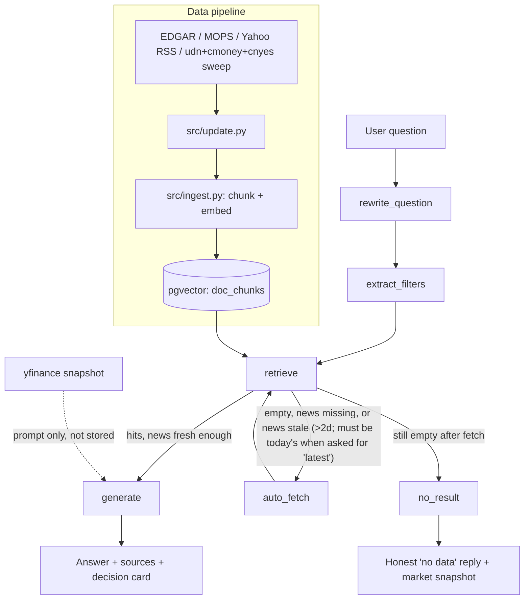
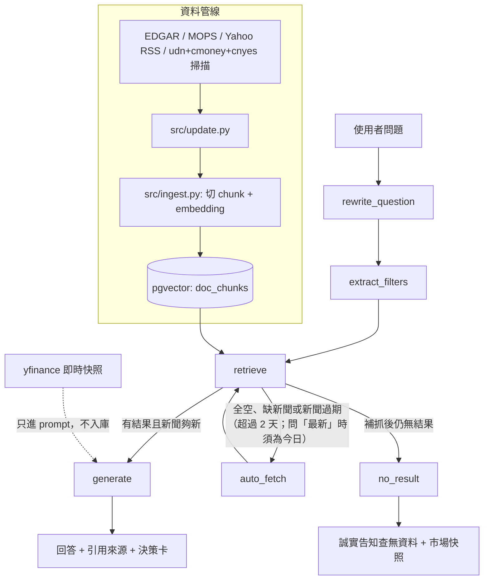

# Project Documentation / 專案文件

[English](#english) | [中文](#中文)

---

<a id="english"></a>
## English

A local RAG assistant for stock financial reports and news, built with LangGraph + Ollama + pgvector. See also the main [README](../README.md).

### Architecture



### LangGraph node flow

`rewrite_question → extract_filters → retrieve → (generate | auto_fetch → retrieve | no_result)`

| Node | Role |
|---|---|
| `rewrite_question` | With chat history, rewrites a follow-up ("what about margins?") into a standalone question so embedding retrieval works; passes through when history is empty |
| `extract_filters` | LLM extracts company code (TW 4-digit or US ticker) / doc type from the question as retrieval filters (null = no filter) |
| `retrieve` | Embeds the question (bge-m3) and runs cosine similarity search in pgvector, top-5; recency keywords ("latest", "today", …, shared `_RECENT_RE`) cap news at 90 days; for company questions also blends in top-3 company news and top-2 global market news as decision-card context |
| `auto_fetch` | Runs once (guarded by `fetched`). Triggered when retrieval is empty, company news is missing, or the newest news is stale — older than 2 days, tightened to "must be today's" when the question carries a recency keyword. If a company was named: fetches its reports + news (report fetch skipped only when a `financial_report` chunk was actually retrieved), always also sweeps market-news (top-3, `fetch_market_news`); a company-less empty retrieval sweeps market-news too, so it never dead-ends at `no_result` on the first try. Single-source failures are swallowed, not fatal |
| `generate` | Answers strictly from retrieved chunks with `[SourceN]` citations, folds in a live yfinance market snapshot (price, 52w range, PE, target price, analyst view, plus analyst consensus: current-quarter EPS/revenue consensus range, analyst count, past-4-quarter beat/miss, next earnings date — prompt-only, never a citable source, degrades silently on failure), then appends a fixed decision-card section (facts w/ citations, inference, valuation, consensus & thresholds, scenario read, earnings-call watch list, stance, triggers, key event, watch metrics) with a disclaimer; stance is only asserted when filings+news+market data support it, but triggers/key event/watch metrics are always required so the answer never abstains outright |
| `no_result` | When nothing is retrieved even after auto_fetch, honestly says so, still appending the market snapshot and watch items instead of hallucinating |

### Modules (`src/`)

| File | Purpose |
|---|---|
| `config.py` | Central settings from `.env` (DB URL, Ollama URL/models, chunking, top-k, SEC user agent) |
| `vectorstore.py` | psycopg + pgvector access layer: `insert_chunks`, `delete_by_source`, `similarity_search` |
| `ingest.py` | `ingest_text` (chunk → embed → insert, deduped by source) and `ingest_file` (PDF/txt loader); CLI `python -m src.ingest` |
| `update.py` | Manual fetchers: SEC EDGAR (US 10-Q/10-K, falling back to 6-K/20-F for foreign issuers and 424B4/S-1 for new listings), MOPS (TW report PDFs), Yahoo Finance RSS news, market-news sweep (udn/cmoney/cnyes listing pages via trafilatura); CLI `python -m src.update` |
| `market.py` | `get_market_snapshot(company)`: live yfinance quote (price, 52w range, PE, target price, analyst view) plus an analyst-consensus block (next earnings date, current-quarter EPS/revenue consensus range, analyst count, past-4-quarter beat/miss), formatted for the prompt only — each block fails independently, any failure returns `None`/skips and never raises |
| `charts.py` | Real-data plotly charts (`price_chart`: 6-month close line with next-earnings marker; `eps_chart`: 8-quarter EPS estimate vs actual, beat green / miss red) and `report_pdf` (markdown + charts → PDF via headless Chrome `--print-to-pdf`, charts embedded as kaleido PNGs); every function returns `None` on failure |
| `i18n.py` | Centralized bilingual (zh/en) UI and prompt strings, no i18n library |
| `graph.py` | LangGraph pipeline described above; `build_graph()` returns the compiled app |
| `cli.py` | Terminal chat (single-turn) |
| `app.py` | Chainlit web UI: token streaming, multi-turn (last 5 rounds in session memory), interactive charts under each answer (`cl.Plotly`), downloadable PDF report per answer (falls back to `.md` when PDF generation fails) |

### DB schema (`db/init.sql`)

Single table `doc_chunks`:

```sql
id BIGSERIAL PK, source VARCHAR(512), doc_type VARCHAR(50),  -- 'financial_report' / 'news'
company VARCHAR(100), published_at DATE, chunk_index INT,
content TEXT, embedding VECTOR(1024),                        -- bge-m3 dimension
created_at TIMESTAMPTZ
```

HNSW cosine index on `embedding`, plus B-tree indexes on `company` and `doc_type`.

### Data sources & update commands

| Data | Source | Command |
|---|---|---|
| US reports | SEC EDGAR (ticker → CIK → latest filing HTML, text via trafilatura; falls back through 10-K → 6-K → 20-F → 424B4 → S-1, so foreign issuers like ASML work) | `python -m src.update report --market us --company AAPL [--form 10-K]` |
| TW reports | TWSE MOPS (`doc.twse.com.tw/server-java/t57sb01`, two-step PDF download) | `python -m src.update report --market tw --company 2330` |
| News | Yahoo Finance RSS (`.TW` suffix auto-added for 4-digit TW codes) | `python -m src.update news --company 2330 --limit 10` |
| Market news | udn (tw/us) + cmoney (notes/tag) + cnyes (us_stock/tw_stock_news) listing pages, article body via trafilatura; titles carrying a 4-digit TW code get auto-tagged with that company; `source_exists()` skips already-ingested articles so re-sweeping is cheap | `python -m src.update market-news [--limit 10]` |
| Live market snapshot | yfinance quote (price, 52w range, PE, target price, analyst view) + analyst consensus (next earnings date, current-quarter EPS/revenue consensus range, analyst count, past-4-quarter beat/miss) — prompt-only, never stored in `doc_chunks` | n/a (fetched inline by `generate`) |
| Prune old news | Deletes news chunks older than N days (default 180); reports are never pruned | `python -m src.update prune --days 180` |

Re-running any command on the same source replaces old chunks (idempotent).

### Design decisions

- **`PGVECTOR_URL` instead of `DATABASE_URL`**: Chainlit treats `DATABASE_URL` as its own persistence-layer setting (requiring asyncpg), so the env var was renamed to avoid the collision.
- **No Google News RSS**: since 2024 its links are encoded internal URLs, so article bodies can't be fetched; Yahoo Finance RSS is used instead.
- **Idempotent ingest**: `ingest_text` deletes all chunks for the same `source` before inserting, so updates can be re-run freely without duplicates.
- **Everything local**: Ollama (qwen3.5:9b + bge-m3) keeps sensitive financial documents on-machine.
- **HNSW over IVFFlat**: the vector index is HNSW because it handles incremental inserts well (no cluster rebuild needed), matching this project's fetch-on-demand write pattern.
- **Market snapshot is prompt-only, never stored**: yfinance data is fetched fresh per question and injected into the `generate` prompt; it's excluded from `doc_chunks` and from the citation numbering since it isn't a retrievable source, and any fetch failure is caught and silently degrades to no snapshot.
- **Decision card can't fully abstain**: `generate` always includes triggers, key event, and watch metrics even with thin data, so the answer stays actionable; only the directional "stance" is gated on having filings+news+market data to back it.
- **No probabilities or confidence scores — consensus thresholds come from real data**: scenario probabilities ("35% chance of a beat") and confidence scores would be hallucinations dressed up as quantification, since the LLM has no probability model behind them; instead the decision card's thresholds are the actual yfinance analyst-consensus range (low/avg/high), and the scenario read is strictly conditional ("if above the high…") with probabilities explicitly forbidden by the prompt's hard rules.
- **PDF via headless Chrome, not weasyprint**: weasyprint needs Homebrew's pango, which fails to load on an arm64 Mac with Intel Homebrew; Chrome's `--print-to-pdf` needs no extra native libraries and renders CJK reliably. No Chrome/Chromium/Edge found → the download gracefully falls back to `.md`.

### Known limitations

- **MOPS scraping is fragile**: no official API; when it breaks, the CLI prints manual download instructions instead of raising.
- **Chat history is per-session only**: kept in memory (last 5 rounds), cleared on page refresh; persist to DB if needed.
- Answer quality depends on the local model; figures should be verified against the cited sources.
- News recency filtering is a keyword heuristic ("最近", "recent", ...) that caps news at 90 days; for finer control, move the judgment into `extract_filters`.
- **6-K may not be a financial report**: EDGAR's 6-K form covers any material announcement by a foreign issuer, so the "latest 6-K" fallback can occasionally ingest a non-earnings filing.
- **No multi-company comparison**: a question naming two companies degrades to a market-news sweep instead of a side-by-side analysis.

---

<a id="中文"></a>
## 中文

以 LangGraph + Ollama + pgvector 打造的本地個股財報/新聞 RAG 助理。另見主 [README](../README.md)。

### 架構



### LangGraph 節點流程

`rewrite_question → extract_filters → retrieve → (generate | auto_fetch → retrieve | no_result)`

| 節點 | 職責 |
|---|---|
| `rewrite_question` | 有對話歷史時,把追問(「那毛利率呢?」)改寫成獨立問題,讓 embedding 檢索有效;無歷史直接通過 |
| `extract_filters` | 用 LLM 從問題抽出公司代號(台股 4 碼或美股 ticker)/文件類型作為檢索 filter(null 表示不過濾) |
| `retrieve` | 問題經 bge-m3 embedding 後,在 pgvector 做 cosine 相似度檢索,取 top-5;含時效關鍵字(「最新」「今天」等,共用 `_RECENT_RE`)時新聞限 90 天內;有指名公司時再補 top-3 該公司新聞與 top-2 全域市場新聞,作為決策卡素材 |
| `auto_fetch` | 只執行一次（`fetched` 保護）。觸發條件:檢索全空、指名公司缺新聞,或最新新聞過期——超過 2 天,問題含時效關鍵字時收緊為「必須是今天的新聞」。有指名公司:抓財報+新聞(僅當檢索結果中確實有 `financial_report` chunk 才跳過財報抓取),並一律加掃市場新聞(`fetch_market_news`, top-3);沒指名公司但檢索全空時也觸發市場新聞掃描,避免第一輪就直接舉手投降。單一來源失敗不中斷整體流程 |
| `generate` | 僅根據檢索到的 chunk 回答並標示 `[來源N]`,並併入即時 yfinance 市場快照(股價、52 週區間、本益比、目標價、分析師評等,加上分析師共識:當季 EPS/營收共識區間、分析師人數、近 4 季 beat/miss、下次財報日——僅供 prompt 參考,不算引用來源,失敗時靜默降級),結尾固定追加決策卡一節(附引用的事實、推論、估值、市場共識與門檻、情境解讀、法說會關注清單、立場、觸發條件、關鍵事件、觀察指標)與免責聲明;立場只在財報+新聞+市場數據都支持時才給,但觸發條件/關鍵事件/觀察指標一律要有,回答不會整段棄權 |
| `no_result` | 補抓後仍查無資料時誠實告知,並附上市場快照與觀察項目,避免幻覺 |

### 模組說明(`src/`)

| 檔案 | 用途 |
|---|---|
| `config.py` | 集中設定,從 `.env` 讀取(DB 連線、Ollama URL/模型、chunk 參數、top-k、SEC user agent) |
| `vectorstore.py` | psycopg + pgvector 存取層:`insert_chunks`、`delete_by_source`、`similarity_search` |
| `ingest.py` | `ingest_text`(切 chunk → embedding → 寫入,依 source 去重)與 `ingest_file`(PDF/txt 載入);CLI `python -m src.ingest` |
| `update.py` | 手動抓取:SEC EDGAR(美股 10-Q/10-K,外國發行人退回 6-K/20-F、新上市退回 424B4/S-1)、MOPS(台股財報 PDF)、Yahoo Finance RSS 新聞、udn/cmoney/鉅亨網 cnyes 市場新聞列表頁掃描(trafilatura 抽文);CLI `python -m src.update` |
| `market.py` | `get_market_snapshot(company)`:即時 yfinance 報價(股價、52 週區間、本益比、目標價、分析師評等)加分析師共識區塊(下次財報日、當季 EPS/營收共識區間、分析師人數、近 4 季 beat/miss),僅供 prompt 使用——各段獨立容錯,失敗一律回傳 `None` 或略過,不拋錯 |
| `charts.py` | 真資料 plotly 圖表(`price_chart`:6 個月收盤線圖含下次財報日標記;`eps_chart`:近 8 季 EPS 預估 vs 實際,beat 綠/miss 紅)與 `report_pdf`(markdown + 圖表 → headless Chrome `--print-to-pdf` 產出 PDF,圖表以 kaleido PNG 內嵌);所有函式失敗回 `None` |
| `i18n.py` | 集中管理雙語(中/英)介面與 prompt 字串,不引入 i18n 套件 |
| `graph.py` | 上述 LangGraph 流程;`build_graph()` 回傳編譯後的 app |
| `cli.py` | 終端聊天(單輪) |
| `app.py` | Chainlit 網頁介面:token 逐字串流、多輪對話(session 記憶體保留最近 5 輪)、回答下方附互動圖表(`cl.Plotly`)、每則回答附可下載 PDF 報告(PDF 生成失敗時退回 `.md`) |

### DB schema(`db/init.sql`)

單一資料表 `doc_chunks`:

```sql
id BIGSERIAL PK, source VARCHAR(512), doc_type VARCHAR(50),  -- 'financial_report' / 'news'
company VARCHAR(100), published_at DATE, chunk_index INT,
content TEXT, embedding VECTOR(1024),                        -- bge-m3 維度
created_at TIMESTAMPTZ
```

`embedding` 上有 HNSW cosine 索引,`company` 與 `doc_type` 各有 B-tree 索引。

### 資料來源與更新指令

| 資料 | 來源 | 指令 |
|---|---|---|
| 美股財報 | SEC EDGAR(ticker → CIK → 最新申報 HTML,trafilatura 抽文字;依序退回 10-K → 6-K → 20-F → 424B4 → S-1,ASML 這類外國發行人也抓得到) | `python -m src.update report --market us --company AAPL [--form 10-K]` |
| 台股財報 | 公開資訊觀測站 MOPS(`doc.twse.com.tw/server-java/t57sb01` 兩步下載 PDF) | `python -m src.update report --market tw --company 2330` |
| 新聞 | Yahoo Finance RSS(4 碼台股代號自動加 `.TW`) | `python -m src.update news --company 2330 --limit 10` |
| 市場新聞 | udn(tw/us)+ cmoney(notes/tag)+ 鉅亨網 cnyes(us_stock/tw_stock_news)新聞列表頁,內文用 trafilatura 抽取;標題含 4 碼台股代號會自動標記該公司;`source_exists()` 跳過已入庫文章,重複掃描成本很低 | `python -m src.update market-news [--limit 10]` |
| 即時市場快照 | yfinance 報價(股價、52 週區間、本益比、目標價、分析師評等)加分析師共識(下次財報日、當季 EPS/營收共識區間、分析師人數、近 4 季 beat/miss)——僅供 prompt 使用,不寫入 `doc_chunks` | 無(由 `generate` 即時抓取) |
| 清理舊新聞 | 刪除超過 N 天的新聞 chunk(預設 180 天;財報一律保留) | `python -m src.update prune --days 180` |

同一 source 重跑會先刪舊 chunk 再寫入(idempotent)。

### 設計決策

- **用 `PGVECTOR_URL` 而非 `DATABASE_URL`**:Chainlit 會把 `DATABASE_URL` 當成自己的持久化層設定(需 asyncpg),改名避免撞名。
- **不用 Google News RSS**:2024 年後其連結改為編碼過的內部網址,抓不到原文,改用 Yahoo Finance RSS。
- **Idempotent ingest**:`ingest_text` 寫入前先刪除同 `source` 的舊 chunk,更新指令可任意重跑不會重複。
- **全部本地執行**:Ollama(qwen3.5:9b + bge-m3)讓財報這類敏感資料不出本機。
- **HNSW 而非 IVFFlat**:向量索引改用 HNSW,增量寫入不需重建分群,符合本專案隨用隨抓的寫入模式。
- **市場快照只進 prompt,不入庫**:yfinance 資料每次問答即時抓取後併入 `generate` 的 prompt;不寫進 `doc_chunks`,也不計入引用編號,因為它不是可檢索的來源,抓取失敗一律靜默降級成無快照。
- **決策卡不整段棄權**:即使資料稀薄,`generate` 仍固定要求觸發條件、關鍵事件、觀察指標,讓回答保持可執行;只有方向性的「立場」需要財報+新聞+市場數據齊全才會給。
- **不輸出機率與信心分數——共識門檻用真實數據**:情境機率(「35% 機率 beat」)與信心分數是包裝成量化的幻覺,LLM 背後沒有任何機率模型;決策卡的門檻改用 yfinance 真實分析師共識區間(low/avg/high),情境解讀限定為條件式描述(「若高於上緣…」),prompt 硬規則明文禁止機率數字。
- **PDF 用 headless Chrome 而非 weasyprint**:weasyprint 依賴 Homebrew 的 pango,在 arm64 Mac + Intel Homebrew 環境載不起來;Chrome 的 `--print-to-pdf` 零額外原生依賴且中文渲染最穩。找不到 Chrome/Chromium/Edge 時,下載檔優雅退回 `.md`。

### 已知限制

- **MOPS 爬取脆弱**:無官方 API,掛掉時 CLI 會印手動下載指引而非拋錯。
- **對話歷史僅存單次 session**:記憶體保留最近 5 輪,重整即清空;需要持久化再存 DB。
- 回答品質受本地模型限制,數字請對照引用來源確認。
- 新聞時效過濾為關鍵字啟發式(「最近」「recent」等 → 只取 90 天內新聞);要更準可改由 `extract_filters` 的 LLM 判斷。
- **6-K 不一定是財報**:EDGAR 的 6-K 涵蓋外國發行人的任何重大公告,「取最新一份 6-K」的 fallback 偶爾會抓到非財報申報。
- **不支援多公司比較**:同時指名兩間公司的問題會降級為市場新聞掃描,不會做並列分析。
