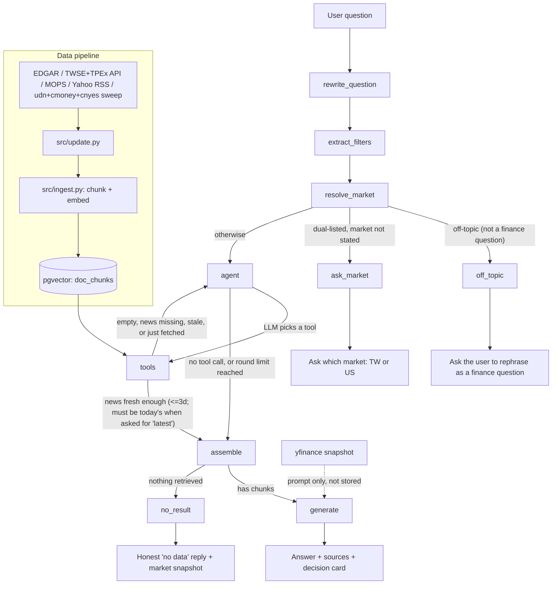
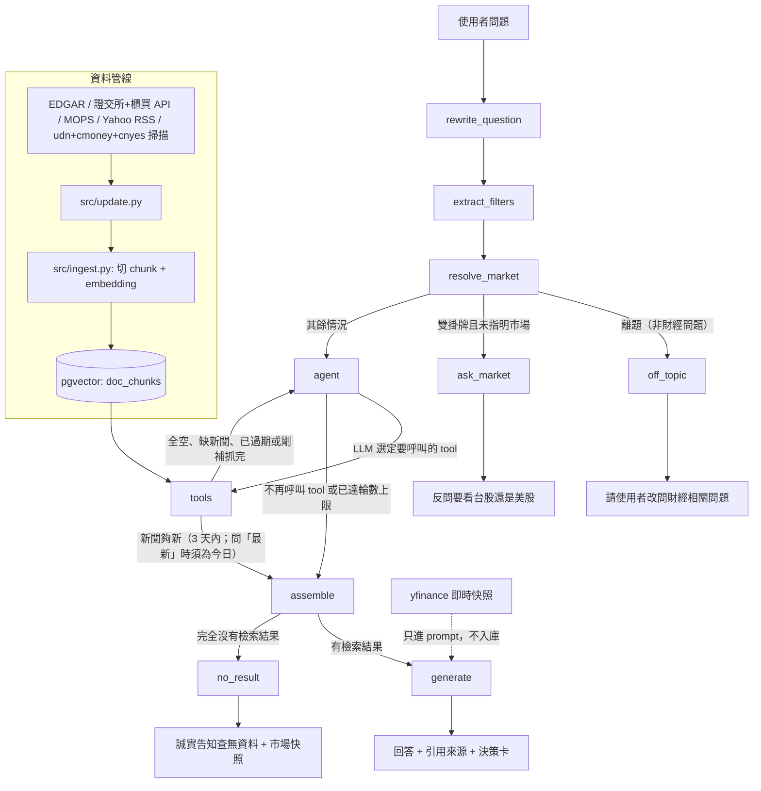

# Project Documentation / 專案文件

[English](#english) | [中文](#中文)

---

<a id="english"></a>
## English

A local RAG assistant for stock financial reports and news, built with LangGraph + Ollama + pgvector. See also the main [README](../README.md).

### Architecture


```mermaid
flowchart TD
    U[User question] --> RW[rewrite_question]
    RW --> EF[extract_filters]
    EF --> RM[resolve_market]
    RM -->|"off-topic (not a finance question)"| OT[off_topic]
    RM -->|"dual-listed, market not stated"| AM[ask_market]
    RM -->|otherwise| AG[agent]
    AG -->|LLM picks a tool| TL[tools]
    AG -->|no tool call, or round limit reached| AS[assemble]
    TL -->|"news fresh enough (<=3d; must be today's when asked for 'latest')"| AS
    TL -->|"empty, news missing, stale, or just fetched"| AG
    AS -->|has chunks| GEN[generate]
    AS -->|nothing retrieved| NR[no_result]
    GEN --> A[Answer + sources + decision card]
    NR --> B["Honest 'no data' reply + market snapshot"]
    OT --> C[Ask the user to rephrase as a finance question]
    AM --> D[Ask which market: TW or US]

    subgraph Data pipeline
        SRC[EDGAR / TWSE+TPEx API / MOPS / Yahoo RSS / udn+cmoney+cnyes sweep] --> UP[src/update.py]
        UP --> ING[src/ingest.py: chunk + embed]
        ING --> PG[(pgvector: doc_chunks)]
    end
    PG --> TL
    YF[yfinance snapshot] -.prompt only, not stored.-> GEN
```

### LangGraph node flow

`rewrite_question → extract_filters → resolve_market → (off_topic | ask_market | agent ⇄ tools → assemble → (generate | no_result))`

| Node | Role |
|---|---|
| `rewrite_question` | With chat history, rewrites a follow-up ("what about margins?") into a standalone question so embedding retrieval works; passes through when history is empty |
| `extract_filters` | LLM extracts company code (TW 4-digit or US ticker) / doc type from the question as retrieval filters (null = no filter); also extracts a `companies` list (every ticker named in the question; a TW/US dual-listed pair of the same company is collapsed to one) |
| `resolve_market` | Aligns the company code to the market the user asked for, and decides whether this turn stops early: off-topic questions go to `off_topic`, dual-listed tickers with no market stated go to `ask_market` |
| `off_topic` | The question is outside finance (weather, recipes, chit-chat), judged by the `in_scope` field `extract_filters` already returns. Replies asking the user to rephrase; no retrieval, no fetching |
| `agent` | Binds the MCP tools to the LLM and lets it decide which tool to call and whether to call another. Freshness rules live in the tool docstrings (`src/mcp_server.py`), not in code. `_trim_for_llm` strips the structured `chunks` from the copy sent to the model, keeping only `summary_for_llm` — the full payload stays in state for `assemble`. Capped at 4 tool rounds. With multiple companies, the agent is instructed to search each ticker separately, freshness is judged per company, and the market re-ask is skipped |
| `tools` | Runs the tool the LLM chose (`ToolNode`). Afterwards `route_after_tools` short-circuits straight to `assemble` when the retrieved news is clearly fresh enough (within 3 days, tightened to "must be today's" when the question carries a recency keyword), saving one redundant agent round; every other case — empty, no news, stale, undated, or a fetch tool just ran — goes back to `agent` so the LLM keeps the fetch decision |
| `assemble` | Restores the tool results into the fields downstream nodes already expect: `retrieved` from the last `search_knowledge_base` call, plus `fetched`/`fetch_results` for `no_result` |
| `generate` | Answers strictly from retrieved chunks with `[SourceN]` citations, folds in a live yfinance market snapshot (price, 52w range, PE, target price, analyst view, plus analyst consensus: current-quarter EPS/revenue consensus range, analyst count, past-4-quarter beat/miss, next earnings date — prompt-only, never a citable source, degrades silently on failure), then appends a fixed decision-card section (facts w/ citations, inference, valuation, consensus & thresholds, scenario read, earnings-call watch list, stance, triggers, key event, watch metrics) with a disclaimer; stance is only asserted when filings+news+market data support it, but triggers/key event/watch metrics are always required so the answer never abstains outright; with multiple companies and retrieved material, a `comparison` field is added to the decision card |
| `no_result` | When nothing is retrieved even after the LLM's fetch attempts, honestly says so, still appending the market snapshot and watch items instead of hallucinating |

### Modules (`src/`)

| File | Purpose |
|---|---|
| `config.py` | Central settings from `.env` (DB URL, Ollama URL/models, chunking, top-k, SEC user agent) |
| `vectorstore.py` | psycopg + pgvector access layer: `insert_chunks`, `delete_by_source`, `similarity_search` |
| `ingest.py` | `ingest_text` (chunk → embed → insert, deduped by source) and `ingest_file` (PDF/txt loader); CLI `python -m src.ingest` |
| `tickers.py` | TW / US ticker format detection and normalization (plus dual-listing peer lookup) |
| `update.py` | Manual fetchers: SEC EDGAR (US 10-Q/10-K, falling back to 6-K/20-F for foreign issuers and 424B4/S-1 for new listings), TW filings on two tracks (official TWSE/TPEx OpenAPI for figures, MOPS PDFs for narrative), Yahoo Finance RSS news, market-news sweep (udn/cmoney/cnyes listing pages via trafilatura); CLI `python -m src.update` |
| `market.py` | `get_market_snapshot(company)`: live yfinance quote (price, 52w range, PE, target price, analyst view) plus an analyst-consensus block (next earnings date, current-quarter EPS/revenue consensus range, analyst count, past-4-quarter beat/miss), formatted for the prompt only — each block fails independently, any failure returns `None`/skips and never raises. Also provides `get_market_snapshots(companies)` (snapshots for several tickers at once, for multi-company questions) and `get_adr_premium(tw, us)` (dual-listing block: computed ADR premium and ADR EPS per-share equivalent, with currency/units and fiscal quarter labeled) |
| `mcp_server.py` | MCP server exposing RAG retrieval and report/news fetching as single-purpose tools; serves both the LangGraph `agent` node and external MCP clients through the same tool definitions. Bearer token auth via `MCP_AUTH_TOKEN` (refuses to start without one inside a container); not exposed outside the docker network |
| `charts.py` | Real-data plotly charts (`price_chart`: 6-month close line with next-earnings marker; `eps_chart`: 8-quarter EPS estimate vs actual, beat green / miss red) and `report_pdf` (markdown + charts → PDF via headless Chrome `--print-to-pdf`, charts embedded as kaleido PNGs); every function returns `None` on failure |
| `i18n.py` | Centralized bilingual (zh/en) UI and prompt strings, no i18n library |
| `graph.py` | LangGraph pipeline described above; `build_graph()` returns the compiled app |
| `tracing.py` | Langfuse tracing of LangGraph LLM calls; never raises, missing keys or an unreachable Langfuse just means no trace |
| `logging_setup.py` | Central logging: stdout plus a daily JSON Lines file under `LOG_DIR` (retention `LOG_BACKUP_DAYS`); each entry point calls `setup_logging("app"\|"mcp"\|"update")` once |
| `cli.py` | Terminal chat (single-turn) |
| `app.py` | Chainlit web UI: token streaming, multi-turn (last 5 rounds in session memory), interactive charts under each answer (`cl.Plotly`), downloadable PDF report per answer (falls back to `.md` when PDF generation fails) |

### DB schema (`db/init.sql`)

Single table `doc_chunks`:

```sql
id BIGSERIAL PK, source VARCHAR(512), doc_type VARCHAR(50),  -- 'financial_report' / 'news'
company VARCHAR(100), published_at DATE, chunk_index INT,
market VARCHAR(2),                                             -- 'tw' / 'us' / NULL (unknown market)
content TEXT, embedding VECTOR(1024),                        -- bge-m3 dimension
created_at TIMESTAMPTZ
```

HNSW cosine index on `embedding`, plus B-tree indexes on `company`, `doc_type`, and `market`.

### Data sources & update commands

| Data | Source | Command |
|---|---|---|
| US reports | SEC EDGAR (ticker → CIK → latest filing HTML, text via trafilatura; falls back through 10-K → 6-K → 20-F → 424B4 → S-1, so foreign issuers like ASML work) | `python -m src.update report --market us --company AAPL [--form 10-K]` |
| TW report figures | Official OpenAPI: TWSE `openapi.twse.com.tw` (listed) with TPEx `tpex.org.tw` (OTC) fallback; latest quarter's income statement + balance sheet as JSON, no auth | `python -m src.update report --market tw --company 2330` (runs both tracks) |
| TW report narrative | TWSE MOPS (`doc.twse.com.tw/server-java/t57sb01`, two-step PDF download) | same command as above |
| News | Yahoo Finance RSS (`.TW` suffix auto-added for 4-digit TW codes); 4-digit TW tickers also use the Yahoo TW stock page (`tw.stock.yahoo.com/quote/{code}.TW/news`, `fetch_tw_stock_news`) | `python -m src.update news --company 2330 --limit 10` |
| Market news | udn (tw/us) + cmoney (notes/tag) + cnyes (us_stock/tw_stock_news) listing pages, article body via trafilatura; titles carrying a 4-digit TW code get auto-tagged with that company; `source_exists()` skips already-ingested articles so re-sweeping is cheap | `python -m src.update market-news [--limit 10]` |
| Live market snapshot | yfinance quote (price, 52w range, PE, target price, analyst view) + analyst consensus (next earnings date, current-quarter EPS/revenue consensus range, analyst count, past-4-quarter beat/miss) — prompt-only, never stored in `doc_chunks` | n/a (fetched inline by `generate`) |
| Source inventory | Read-only inventory of ingested sources and per-track gaps; no data changes | `python -m src.update inventory [--doc-type news] [--company 2330]` |
| Prune old news | Deletes news chunks older than N days (default 180); reports are never pruned | `python -m src.update prune --days 180` |

Re-running any command on the same source replaces old chunks (idempotent).

### Design decisions

- **`PGVECTOR_URL` instead of `DATABASE_URL`**: Chainlit treats `DATABASE_URL` as its own persistence-layer setting (requiring asyncpg), so the env var was renamed to avoid the collision.
- **No Google News RSS**: since 2024 its links are encoded internal URLs, so article bodies can't be fetched; Yahoo Finance RSS is used instead.
- **Idempotent ingest**: `ingest_text` deletes all chunks for the same `source` before inserting, so updates can be re-run freely without duplicates.
- **Everything local**: Ollama (qwen3.5:9b + bge-m3) keeps sensitive financial documents on-machine.
- **HNSW over IVFFlat**: the vector index is HNSW because it handles incremental inserts well (no cluster rebuild needed), matching this project's fetch-on-demand write pattern.
- **Market decision at write time, not query time**: the `market` column ('tw'/'us'/NULL) is decided once by the ingest layer (`ingest_text` by ticker, `_market_of_source` by source key suffix), not inferred later from ticker regex; this avoids ticker-shape misclassification (0700 Hong Kong, 7203 Japan) and keeps the decision in one place. Retrieval filters out `market IS NULL` chunks when a market is specified, excluding unidentifiable cross-market news from results.
- **Market snapshot is prompt-only, never stored**: yfinance data is fetched fresh per question and injected into the `generate` prompt; it's excluded from `doc_chunks` and from the citation numbering since it isn't a retrievable source, and any fetch failure is caught and silently degrades to no snapshot.
- **Decision card can't fully abstain**: `generate` always includes triggers, key event, and watch metrics even with thin data, so the answer stays actionable; only the directional "stance" is gated on having filings+news+market data to back it.
- **No probabilities or confidence scores — consensus thresholds come from real data**: scenario probabilities ("35% chance of a beat") and confidence scores would be hallucinations dressed up as quantification, since the LLM has no probability model behind them; instead the decision card's thresholds are the actual yfinance analyst-consensus range (low/avg/high), and the scenario read is strictly conditional ("if above the high…") with probabilities explicitly forbidden by the prompt's hard rules.
- **PDF via headless Chrome, not weasyprint**: weasyprint needs Homebrew's pango, which fails to load on an arm64 Mac with Intel Homebrew; Chrome's `--print-to-pdf` needs no extra native libraries and renders CJK reliably. No Chrome/Chromium/Edge found → the download gracefully falls back to `.md`.
- **One `num_ctx` for all ChatOllama instances (`OLLAMA_NUM_CTX`, default 32768)**: the Ollama default (4096) truncated prompts (p50 ~6k, max ~22k tokens), causing missing decision-card fields and no citations; 32768 covers the longest observed prompt (16384 does not). All three ChatOllama instances (llm / filters / tool) must share the value, because a different `num_ctx` makes Ollama reload the model.

### Known limitations

Details for each item are in [MAINTENANCE_LOG](MAINTENANCE_LOG.md).

- **Response latency 186–470 s on local hardware**: qwen3.5:9b via Ollama runs at ≈10 chars/s, and reading an 11k-token prompt alone takes ~130 s; a hardware limit, not an architecture issue.
- **TW narrative text depends on scraping MOPS**: no official API, so management discussion, risks and outlook go missing when it breaks; figures are unaffected.
- **No API figures for financial-sector companies**: the official OpenAPI covers general industry only; these firms fall back to the MOPS track alone.
- Answer quality depends on the local model; verify figures against the cited sources.
- **165 chunks remain `market=NULL`**: 137 cmoney chunks need a re-fetch, 28 udn/cnyes chunks come from unlisted sections.
- **`both` (two-market) queries need duplicate retrieval**: financial data is stored under a single company value, so each market is queried once.
- **mcp-server does not expose a port outside the docker network**; Bearer token auth is ready for when an external client needs it.

---

<a id="中文"></a>
## 中文

以 LangGraph + Ollama + pgvector 打造的本地個股財報/新聞 RAG 助理。另見主 [README](../README.md)。

### 架構


```mermaid
flowchart TD
    U[使用者問題] --> RW[rewrite_question]
    RW --> EF[extract_filters]
    EF --> RM[resolve_market]
    RM -->|"離題（非財經問題）"| OT[off_topic]
    RM -->|"雙掛牌且未指明市場"| AM[ask_market]
    RM -->|其餘情況| AG[agent]
    AG -->|LLM 選定要呼叫的 tool| TL[tools]
    AG -->|不再呼叫 tool 或已達輪數上限| AS[assemble]
    TL -->|"新聞夠新（3 天內；問「最新」時須為今日）"| AS
    TL -->|"全空、缺新聞、已過期或剛補抓完"| AG
    AS -->|有檢索結果| GEN[generate]
    AS -->|完全沒有檢索結果| NR[no_result]
    GEN --> A[回答 + 引用來源 + 決策卡]
    NR --> B[誠實告知查無資料 + 市場快照]
    OT --> C[請使用者改問財經相關問題]
    AM --> D[反問要看台股還是美股]

    subgraph 資料管線
        SRC[EDGAR / 證交所+櫃買 API / MOPS / Yahoo RSS / udn+cmoney+cnyes 掃描] --> UP[src/update.py]
        UP --> ING[src/ingest.py: 切 chunk + embedding]
        ING --> PG[(pgvector: doc_chunks)]
    end
    PG --> TL
    YF[yfinance 即時快照] -.只進 prompt，不入庫.-> GEN
```

### LangGraph 節點流程

`rewrite_question → extract_filters → resolve_market → (off_topic | ask_market | agent ⇄ tools → assemble → (generate | no_result))`

| 節點 | 職責 |
|---|---|
| `rewrite_question` | 有對話歷史時,把追問(「那毛利率呢?」)改寫成獨立問題,讓 embedding 檢索有效;無歷史直接通過 |
| `extract_filters` | 用 LLM 從問題抽出公司代號(台股 4 碼或美股 ticker)/文件類型作為檢索 filter(null 表示不過濾);另抽出 `companies` 清單(問題中提到的所有代號;同一公司的台美雙掛牌合併為一個) |
| `resolve_market` | 把公司代號對齊到使用者要的市場,並決定本輪是否提早收工:離題問題轉 `off_topic`,雙掛牌卻沒指明市場轉 `ask_market` |
| `off_topic` | 問題不在財經範圍(天氣、食譜、閒聊),依 `extract_filters` 一併抽出的 `in_scope` 判定。直接請使用者改問,本輪不檢索也不補抓 |
| `agent` | 把 MCP tool 綁給 LLM,由它自行決定要呼叫哪個 tool、要不要再呼叫下一個。時效判準寫在 tool 的 docstring(`src/mcp_server.py`)而非程式碼裡。`_trim_for_llm` 會把送進模型的複本中的結構化 `chunks` 裁掉、只留 `summary_for_llm`,完整內容留在 state 供 `assemble` 使用。tool 呼叫上限 4 輪。問及多間公司時,agent 會被指示對每個代號分別檢索,時效逐公司判斷,並略過市場反問 |
| `tools` | 執行 LLM 選定的 MCP tool(`ToolNode`)。之後由 `route_after_tools` 判斷:檢索到的新聞明顯夠新時(3 天內,`extract_filters` 抽出的時效窗在 7 天內時收緊為「必須是今天」)直接跳到 `assemble`,省下一輪重複的 agent 決策;其餘情況(全空、沒有新聞、已過期、日期不明,或剛跑完補抓 tool)一律回 `agent`,補抓與否仍由 LLM 決定 |
| `assemble` | 把 tool 回傳結果還原成下游節點原本就在用的欄位:`retrieved` 取最後一次 `search_knowledge_base` 的結果,另填 `fetched`/`fetch_results` 供 `no_result` 使用 |
| `generate` | 僅根據檢索到的 chunk 回答並標示 `[來源N]`,並併入即時 yfinance 市場快照(股價、52 週區間、本益比、目標價、分析師評等,加上分析師共識:當季 EPS/營收共識區間、分析師人數、近 4 季 beat/miss、下次財報日——僅供 prompt 參考,不算引用來源,失敗時靜默降級),結尾固定追加決策卡一節(附引用的事實、推論、估值、市場共識與門檻、情境解讀、法說會關注清單、立場、觸發條件、關鍵事件、觀察指標)與免責聲明;立場只在財報+新聞+市場數據都支持時才給,但觸發條件/關鍵事件/觀察指標一律要有,回答不會整段棄權;問及多間公司且有檢索內容時,決策卡另加 `comparison` 比較欄位 |
| `no_result` | 補抓後仍查無資料時誠實告知,並附上市場快照與觀察項目,避免幻覺 |

### 模組說明(`src/`)

| 檔案 | 用途 |
|---|---|
| `config.py` | 集中設定,從 `.env` 讀取(DB 連線、Ollama URL/模型、chunk 參數、top-k、SEC user agent) |
| `vectorstore.py` | psycopg + pgvector 存取層:`insert_chunks`、`delete_by_source`、`similarity_search` |
| `ingest.py` | `ingest_text`(切 chunk → embedding → 寫入,依 source 去重)與 `ingest_file`(PDF/txt 載入);CLI `python -m src.ingest` |
| `tickers.py` | 台股/美股代號格式判別與正規化(含雙掛牌對應查詢) |
| `update.py` | 手動抓取:SEC EDGAR(美股 10-Q/10-K,外國發行人退回 6-K/20-F、新上市退回 424B4/S-1)、台股財報兩軌(證交所/櫃買官方 OpenAPI 取數字、MOPS PDF 取文字敘述)、Yahoo Finance RSS 新聞、udn/cmoney/鉅亨網 cnyes 市場新聞列表頁掃描(trafilatura 抽文);CLI `python -m src.update` |
| `market.py` | `get_market_snapshot(company)`:即時 yfinance 報價(股價、52 週區間、本益比、目標價、分析師評等)加分析師共識區塊(下次財報日、當季 EPS/營收共識區間、分析師人數、近 4 季 beat/miss),僅供 prompt 使用——各段獨立容錯,失敗一律回傳 `None` 或略過,不拋錯。另提供 `get_market_snapshots(companies)`(一次取得多檔代號的快照,供多公司問題使用)與 `get_adr_premium(tw, us)`(雙掛牌區塊:計算 ADR 溢價與 ADR 每股 EPS 對應值,標明幣別/單位與財報季度) |
| `mcp_server.py` | MCP 伺服器,將 RAG 檢索與財報/新聞抓取拆成單一用途的 tool;LangGraph 的 `agent` 節點與外部 MCP 用戶端共用同一組 tool 定義。以 `MCP_AUTH_TOKEN` 做 Bearer token 驗證(在容器內未設定即拒絕啟動);不對 docker 網路以外開放 |
| `charts.py` | 真資料 plotly 圖表(`price_chart`:6 個月收盤線圖含下次財報日標記;`eps_chart`:近 8 季 EPS 預估 vs 實際,beat 綠/miss 紅)與 `report_pdf`(markdown + 圖表 → headless Chrome `--print-to-pdf` 產出 PDF,圖表以 kaleido PNG 內嵌);所有函式失敗回 `None` |
| `i18n.py` | 集中管理雙語(中/英)介面與 prompt 字串,不引入 i18n 套件 |
| `graph.py` | 上述 LangGraph 流程;`build_graph()` 回傳編譯後的 app |
| `tracing.py` | 以 Langfuse 追蹤 LangGraph 的 LLM 呼叫;不會拋錯,缺少金鑰或 Langfuse 連不上時僅不產生 trace |
| `logging_setup.py` | 集中式日誌:輸出至 stdout,並於 `LOG_DIR` 下寫入每日 JSON Lines 檔(保留天數 `LOG_BACKUP_DAYS`);各進入點啟動時呼叫一次 `setup_logging("app"\|"mcp"\|"update")` |
| `cli.py` | 終端聊天(單輪) |
| `app.py` | Chainlit 網頁介面:token 逐字串流、多輪對話(session 記憶體保留最近 5 輪)、回答下方附互動圖表(`cl.Plotly`)、每則回答附可下載 PDF 報告(PDF 生成失敗時退回 `.md`) |

### DB schema(`db/init.sql`)

單一資料表 `doc_chunks`:

```sql
id BIGSERIAL PK, source VARCHAR(512), doc_type VARCHAR(50),  -- 'financial_report' / 'news'
company VARCHAR(100), published_at DATE, chunk_index INT,
market VARCHAR(2),                                             -- 'tw' / 'us' / NULL (市場未知)
content TEXT, embedding VECTOR(1024),                        -- bge-m3 維度
created_at TIMESTAMPTZ
```

`embedding` 上有 HNSW cosine 索引,`company`、`doc_type` 與 `market` 各有 B-tree 索引。

### 資料來源與更新指令

| 資料 | 來源 | 指令 |
|---|---|---|
| 美股財報 | SEC EDGAR(ticker → CIK → 最新申報 HTML,trafilatura 抽文字;依序退回 10-K → 6-K → 20-F → 424B4 → S-1,ASML 這類外國發行人也抓得到) | `python -m src.update report --market us --company AAPL [--form 10-K]` |
| 台股財報數字 | 官方 OpenAPI:證交所 `openapi.twse.com.tw`(上市)、櫃買 `tpex.org.tw`(上櫃)後備;最新一季綜合損益表 + 資產負債表 JSON,免驗證 | `python -m src.update report --market tw --company 2330`(兩軌一起跑) |
| 台股財報敘述 | 公開資訊觀測站 MOPS(`doc.twse.com.tw/server-java/t57sb01` 兩步下載 PDF) | 同上一列指令 |
| 新聞 | Yahoo Finance RSS(4 碼台股代號自動加 `.TW`);4 碼台股代號另使用 Yahoo 奇摩股市個股頁(`tw.stock.yahoo.com/quote/{code}.TW/news`,`fetch_tw_stock_news`) | `python -m src.update news --company 2330 --limit 10` |
| 市場新聞 | udn(tw/us)+ cmoney(notes/tag)+ 鉅亨網 cnyes(us_stock/tw_stock_news)新聞列表頁,內文用 trafilatura 抽取;標題含 4 碼台股代號會自動標記該公司;`source_exists()` 跳過已入庫文章,重複掃描成本很低 | `python -m src.update market-news [--limit 10]` |
| 即時市場快照 | yfinance 報價(股價、52 週區間、本益比、目標價、分析師評等)加分析師共識(下次財報日、當季 EPS/營收共識區間、分析師人數、近 4 季 beat/miss)——僅供 prompt 使用,不寫入 `doc_chunks` | 無(由 `generate` 即時抓取) |
| 來源盤點 | 唯讀盤點已入庫的來源與各軌缺口,不更動資料 | `python -m src.update inventory [--doc-type news] [--company 2330]` |
| 清理舊新聞 | 刪除超過 N 天的新聞 chunk(預設 180 天;財報一律保留) | `python -m src.update prune --days 180` |

同一 source 重跑會先刪舊 chunk 再寫入(idempotent)。

### 設計決策

- **用 `PGVECTOR_URL` 而非 `DATABASE_URL`**:Chainlit 會把 `DATABASE_URL` 當成自己的持久化層設定(需 asyncpg),改名避免撞名。
- **不用 Google News RSS**:2024 年後其連結改為編碼過的內部網址,抓不到原文,改用 Yahoo Finance RSS。
- **Idempotent ingest**:`ingest_text` 寫入前先刪除同 `source` 的舊 chunk,更新指令可任意重跑不會重複。
- **全部本地執行**:Ollama(qwen3.5:9b + bge-m3)讓財報這類敏感資料不出本機。
- **HNSW 而非 IVFFlat**:向量索引改用 HNSW,增量寫入不需重建分群,符合本專案隨用隨抓的寫入模式。
- **市場別在寫入端決定一次,不在查詢時推導**:`market` 欄位(tw/us/NULL)在 ingest 層決定(有 company 時靠 ticker 判定、市場新聞靠來源 key 尾碼 `_tw`/`_us`),不在查詢時從代號格式推導,避免正則誤判(港股 0700、日股 7203)並集中邏輯。檢索指定市場時排除 `market IS NULL` 的塊,防止無法歸屬的跨市場新聞污染結果。
- **市場快照只進 prompt,不入庫**:yfinance 資料每次問答即時抓取後併入 `generate` 的 prompt;不寫進 `doc_chunks`,也不計入引用編號,因為它不是可檢索的來源,抓取失敗一律靜默降級成無快照。
- **決策卡不整段棄權**:即使資料稀薄,`generate` 仍固定要求觸發條件、關鍵事件、觀察指標,讓回答保持可執行;只有方向性的「立場」需要財報+新聞+市場數據齊全才會給。
- **不輸出機率與信心分數——共識門檻用真實數據**:情境機率(「35% 機率 beat」)與信心分數是包裝成量化的幻覺,LLM 背後沒有任何機率模型;決策卡的門檻改用 yfinance 真實分析師共識區間(low/avg/high),情境解讀限定為條件式描述(「若高於上緣…」),prompt 硬規則明文禁止機率數字。
- **PDF 用 headless Chrome 而非 weasyprint**:weasyprint 依賴 Homebrew 的 pango,在 arm64 Mac + Intel Homebrew 環境載不起來;Chrome 的 `--print-to-pdf` 零額外原生依賴且中文渲染最穩。找不到 Chrome/Chromium/Edge 時,下載檔優雅退回 `.md`。
- **所有 ChatOllama 實例共用同一個 `num_ctx`(`OLLAMA_NUM_CTX`,預設 32768)**:Ollama 預設值(4096)會截斷 prompt(中位數約 6k、最長約 22k token),導致決策卡欄位缺漏、沒有引用;32768 可涵蓋目前觀察到最長的 prompt(16384 不夠)。三個 ChatOllama(llm / filters / tool)必須使用相同數值,因為 `num_ctx` 不同會使 Ollama 重新載入模型。

### 已知限制

各項細節請見 [MAINTENANCE_LOG](MAINTENANCE_LOG.md)。

- **本地硬體上的回應時間為 186–470 秒**:qwen3.5:9b 透過 Ollama 約每秒 10 字元,光是讀取 11k token 的 prompt 就需約 130 秒;此為硬體限制,非架構問題。
- **台股財報文字敘述依賴爬取 MOPS**:MOPS 無官方 API,失效時管理層討論、風險與展望會缺漏;數字部分不受影響。
- **金融業查不到 API 數字**:官方 OpenAPI 僅涵蓋一般業,金融相關業別只能使用 MOPS 這一軌。
- 回答品質受本地模型限制,數字請對照引用來源確認。
- **165 筆 chunk 仍為 `market=NULL`**:其中 137 筆來自 cmoney,須重新抓取;28 筆來自未列入的 udn/cnyes 版面。
- **`both`(兩市場)查詢需重複檢索**:財務資料存放於單一公司欄位下,因此每個市場各查詢一次。
- **mcp-server 不對 docker 網路以外開放連接埠**;Bearer token 驗證已就緒,待外部用戶端有需要時即可使用。
